# lab1 Getting Start
---
用Wireshake捕获一个GET请求
1. [下载实验相关文件](https://gaia.cs.umass.edu/kurose_ross/wireshark.php)， linux下执行`apt install wireshark`下载
2. 参照指导书，[下载Wireshake软件](http://www.wireshark.org/download.html)，这个软件可以捕获计算机发出或接受的数据包(package，其实主要是捕获链路层(link layer)的帧(frame)，因为该数据帧封装(encapsulate)了所有的上层协议)
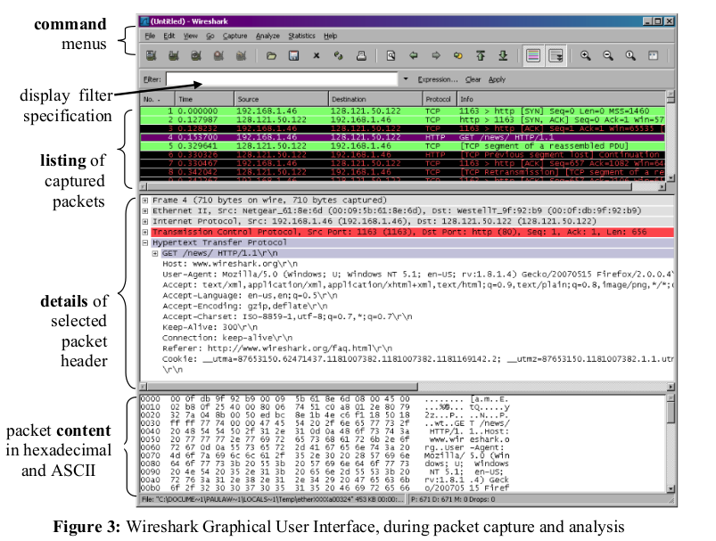
3. 选择Wlan接口(wireless local-area network,这里指wifi)，linux下选择wlp1s0接口，开启捕获
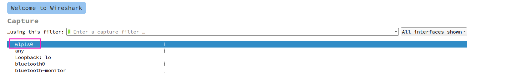
5. 访问[这个网站](http://gaia.cs.umass.edu/wireshark-labs/INTRO-wireshark-file1.html)以发出get请求，Wireshake会捕获这个HTTP信息

注意：
1. 关闭VPN
2. 访问目标网站后，清除浏览器缓存可再次抓包
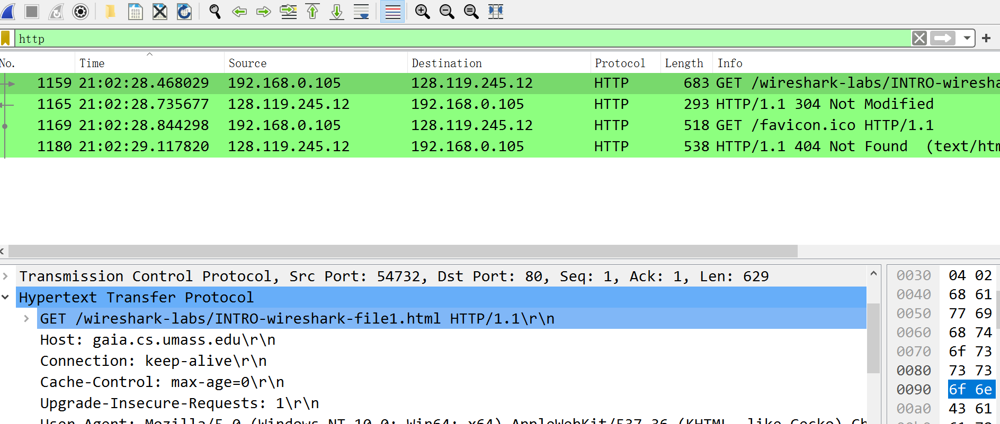从上图，我们得到以下信息：

1. 我在`21:02:28.468029`时发出了GET请求，在`21:02:28.735677`时收到了服务器的HTTP OK 回复
2. 我电脑(source)是IP地址为192.168.0.105, 服务器(Destination)IP地址为128.119.245.12

# lab2 HTTP
---
## 2.1. The Basic HTTP GET/response interaction
捕获成功
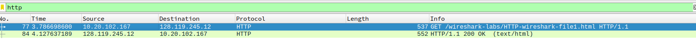
1. Is your browser running HTTP version 1.0 or 1.1? What version of HTTP is the server running?
**browser: HTTP1.1** 
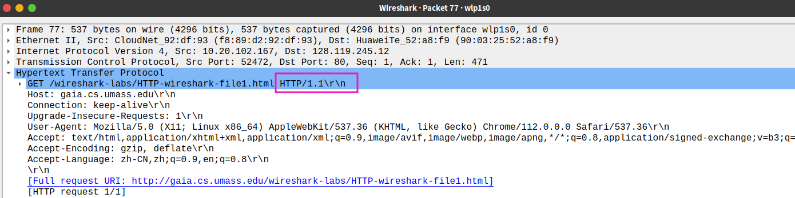
**server:  HTTP1.1**
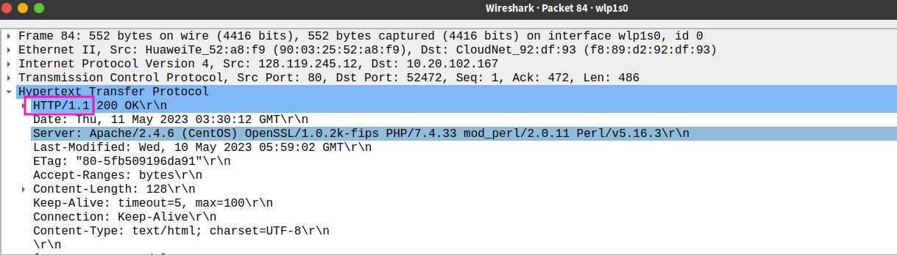
2. What languages (if any) does your browser indicate that it can accept to the server?
**chinese**
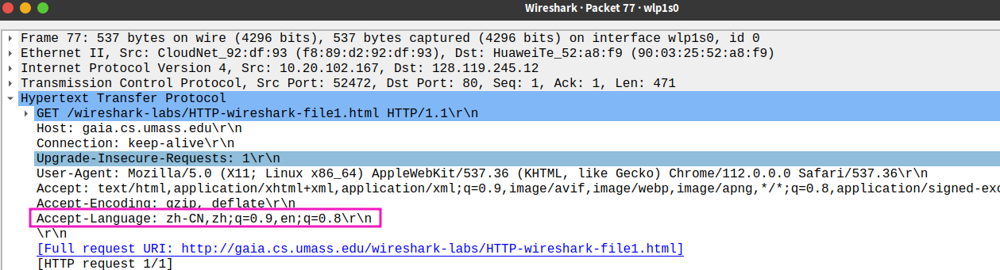
3. What is the IP address of your computer? Of the gaia.cs.umass.edu server?
**my computer:** `10.20.102.167`
**server:** `128.119.245.12`
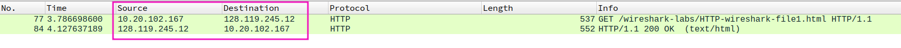
4. What is the status code returned from the server to your browser?
**status code: 200,  means successfully request , message is in the respond**
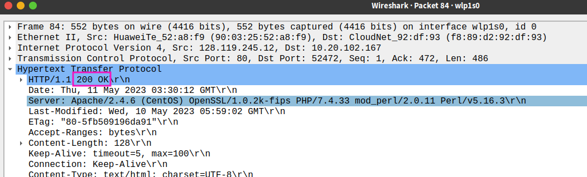
5. When was the HTML file that you are retrieving last modified at the server?
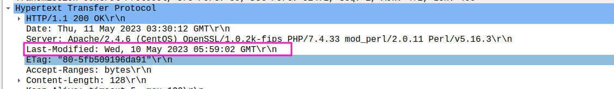
6. How many bytes of content are being returned to your browser?
**128 bytes**
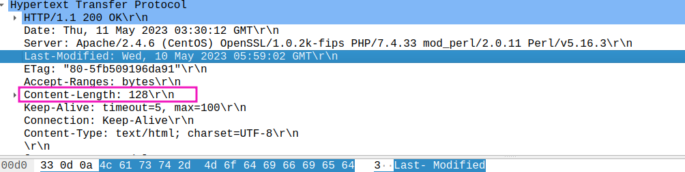
7. By inspecting the raw data in the packet content window, do you see any headers within the data that are not displayed in the packet-listing window? If so, name one.
**no**
## 2.2. The HTTP CONDITIONAL GET/response interaction
捕获成功
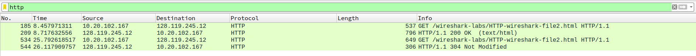
1. Inspect the contents of the first HTTP GET request from your browser to the server. Do you see an “IF-MODIFIED-SINCE” line in the HTTP GET?
**no**
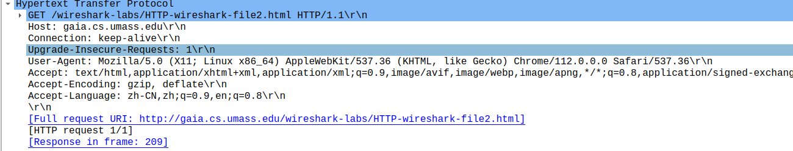
2. Inspect the contents of the server response. Did the server explicitly return the contents of the file? How can you tell?
**yes， there is a text data (entity body) behind headers**
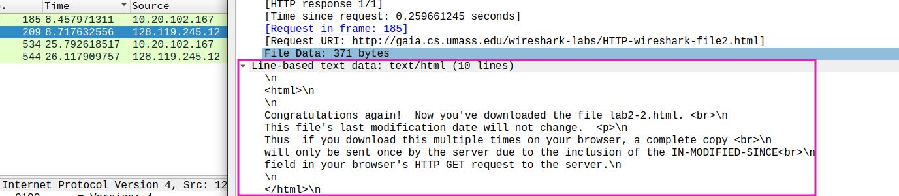
3. Now inspect the contents of the second HTTP GET request from your browser to the server. Do you see an “IF-MODIFIED-SINCE:” line in the HTTP GET? If so, what information follows the “IF-MODIFIED-SINCE:” header?
**yes, information as follows**
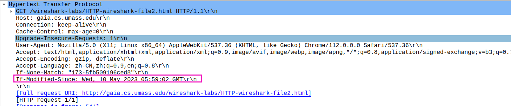
4.   What is the HTTP status code and phrase returned from the server in response to this second HTTP GET? Did the server explicitly return the contents of the file? Explain.
**status code and phrase: 304 Not Modified
no contents behind headers, since proxy server not need to be updated**
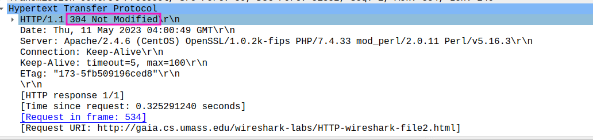
## 2.3. Retrieving Long Documents
捕获成功
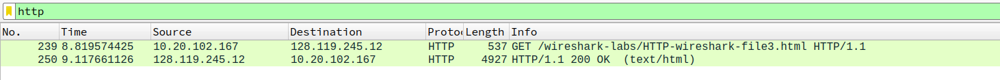
1. How many HTTP GET request messages did your browser send? Which packet number in the trace contains the GET message for the Bill or Rights?
**send 1 GET request messages in 10 seconds,  packet number is** `76`
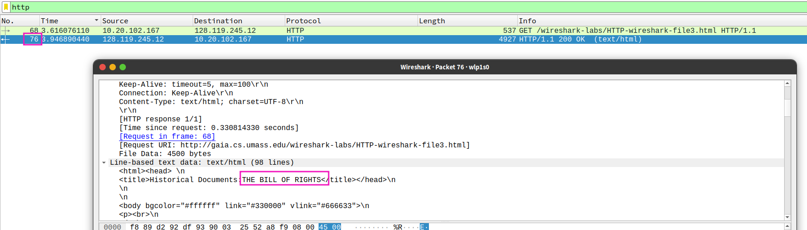
2. Which packet number in the trace contains the status code and phrase associated with the response to the HTTP GET request?
**still** `76`
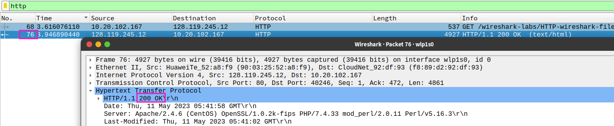
3. What is the status code and phrase in the response?
**200 OK**
4. How many data-containing TCP segments were needed to carry the single HTTP response and the text of the Bill of Rights?
**1,  there is no** `TCP segment of a reassembled PDU` **info display,  i reckon that it is a version problem of wireshark  **
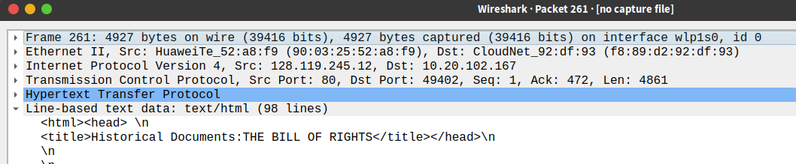
## 2.4. HTML Documents with Embedded Objects
捕获成功
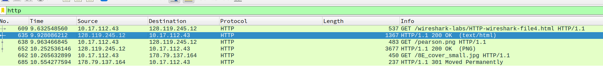
1. How many HTTP GET request messages did your browser send? To which Internet addresses were these GET requests sent?
three
`128.119.245.12`
`128.119.245.12`
`178.79.137.164`
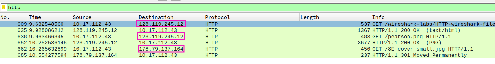
2. Can you tell whether your browser downloaded the two images serially, or whether they were downloaded from the two web sites in parallel? Explain.
**serially, since the GET request send after another GET request getting it's response** 
## 2.5. HTTP Authentication
捕获成功
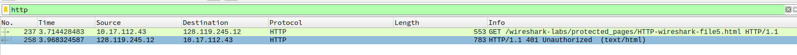
1. What is the server's response (status code and phrase) in response to the initial HTTP GET message from your browser?
**401 Unauthorized**
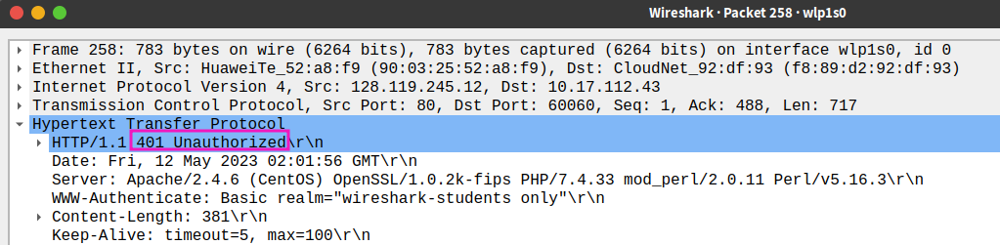
2. When your browser's sends the HTTP GET message for the second time, what new field is included in the HTTP GET message?
**Authorization field**
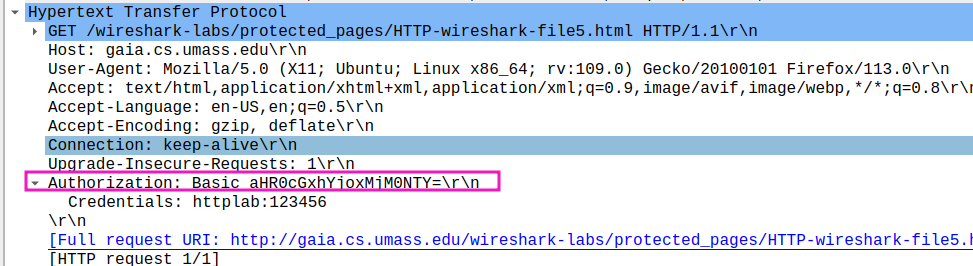
# lab3 DNS
---
## 3.1. nslookup
1. Run nslookup to obtain the IP address of a Web server in Asia. What is the IP address of that server?
**IPV4 address: `166.111.4.100` from DNS Cache**
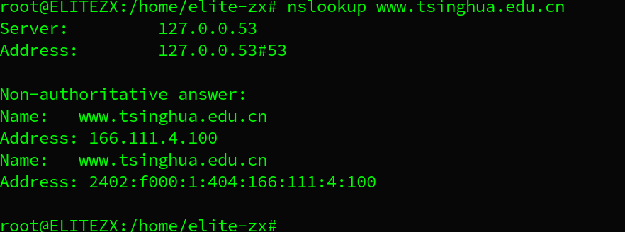
2. Run nslookup to determine the authoritative DNS servers for a university in Europe.
**four imperial college london nameservers**
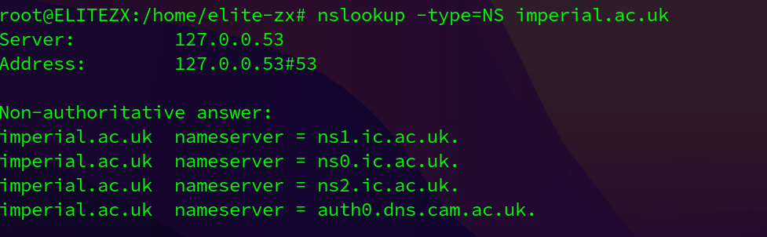
## 3.2. ifconfig
Ubuntu上尽可能等效windows上的`ipconfig /displaydns` 的命令应该是`resolvectl statistics` ,这个命令会显示一些统计数据，包括当前缓存的条目数量、缓存命中次数、缓存未命中次数等。由于安全和隐私的考虑，`resolvectl` 并不提供直接查看全部DNS缓存条目的功能。
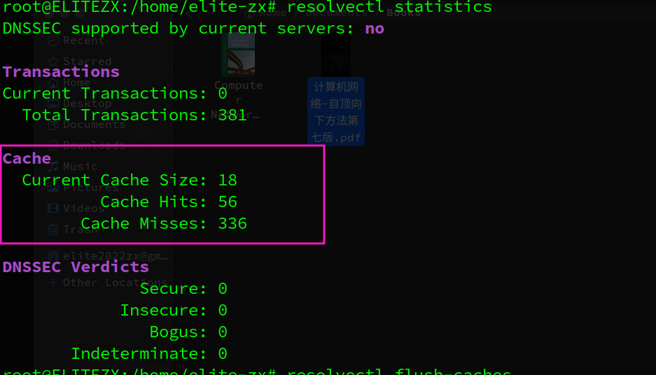
使用`resolvectl flush-caches`清除本机的DNS缓存，再次用`resolvectl statistics`查看DNS缓存条目数量，此时变为0
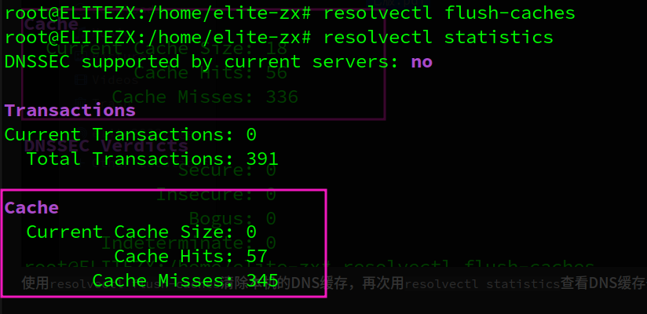
>`resolvectl` ,旧名`systemd-resolved` ，是一个由 systemd 提供的网络名称解析服务，它在 Ubuntu 和其他使用 systemd 的 Linux 发行版上运行。**它负责 DNS 解析和缓存**，mDNS（多播 DNS）解析，LLMNR（链接本地多播名称解析）和 DNSSEC（DNS 安全扩展）验证等功能。
>`resolvectl` 将 DNS 查询结果存储在缓存中，以便在以后进行相同的查询时，可以直接从缓存中获取结果，而不必再次查询远程的 DNS 服务器。这可以显著提高 DNS 解析的速度，尤其是对于经常被查询的名称。
>此外，`resolvectl` 还提供了其他一些功能，例如：
> - 它可以处理 /etc/hosts 文件和静态主机名解析。
>-  它支持 DNS over TLS，这是一种加密 DNS 查询的方法，可以提高隐私和安全性。
>-  它可以处理多个网络接口和多个 DNS 服务器，并可以为每个接口单独配置 DNS 服务器。
>总的来说，`resolvectl` 是一个强大的网络名称解析服务，它提供了许多现代的和有用的功能。
>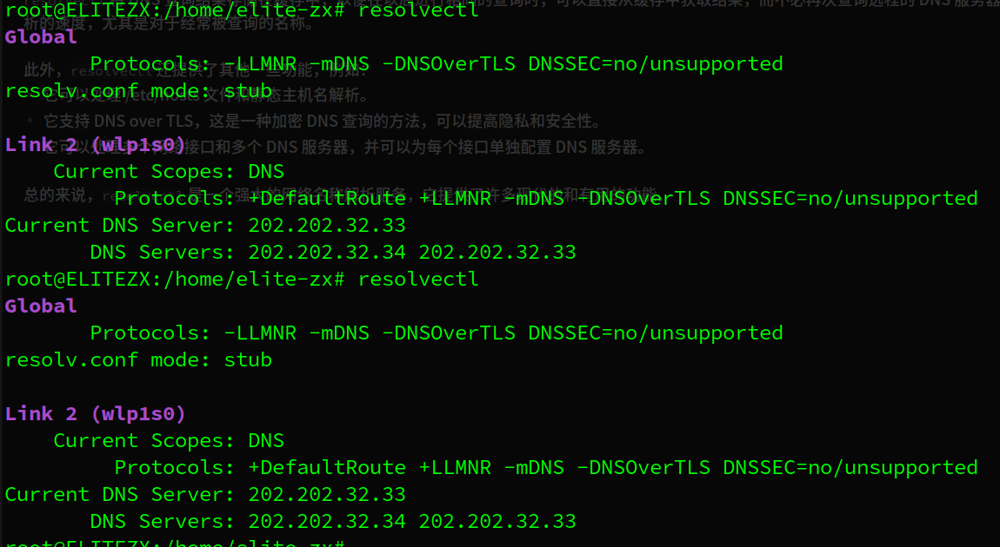
## 3.3. Tracing DNS with Wireshark
捕获成功
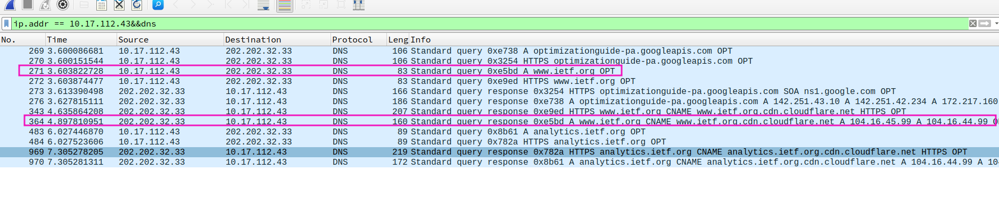
1. Locate the DNS query and response messages. Are then sent over UDP or TCP?
**UDP， 这也符合教材所说的**
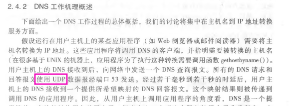
**DNS query:**
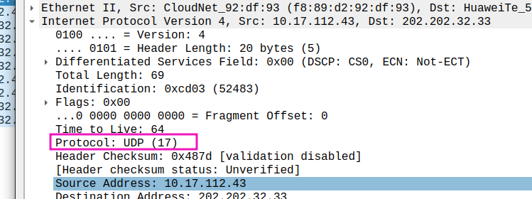
**DNS response:**
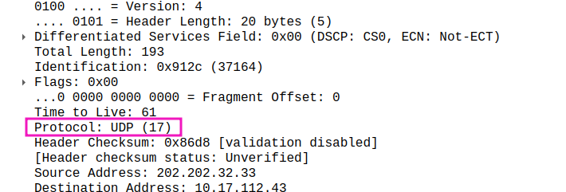
2. What is the destination port for the DNS query message? What is the source port of DNS response message?
**Dst Port of query: 53**
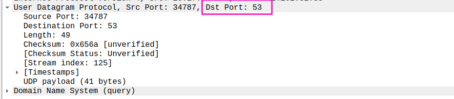
**Src Port of response: 53**
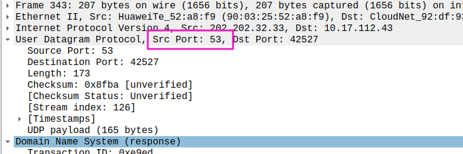
3. To what IP address is the DNS query message sent? Use ipconfig to determine the IP address of your local DNS server. Are these two IP addresses the same?
**linux下使用`resolvectl`获取当前的本地DNS服务器的IP地址**
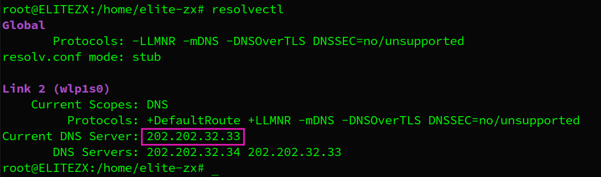
**这与DNS query发送的目的地一致**
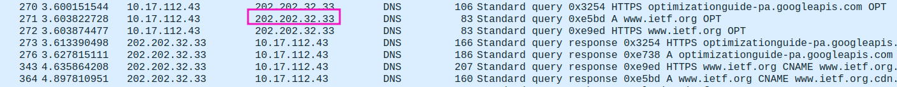
4. Examine the DNS query message. What “Type” of DNS query is it? Does the query message contain any “answers”?
**type A , no answers in query message**
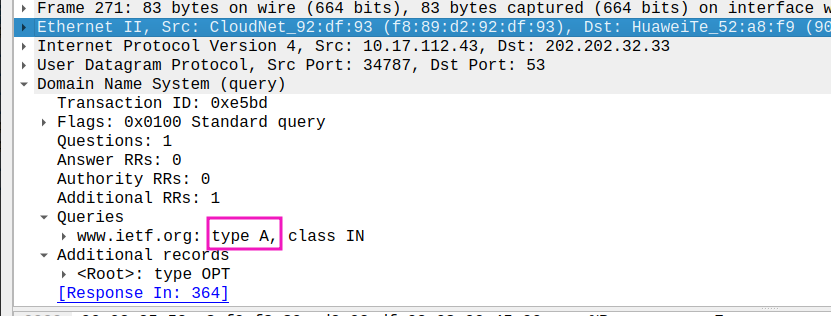
5. Examine the DNS response message. How many “answers” are provided? What do each of these answers contain?
**3个答案，分别是规范主机名，2条目的ip地址**
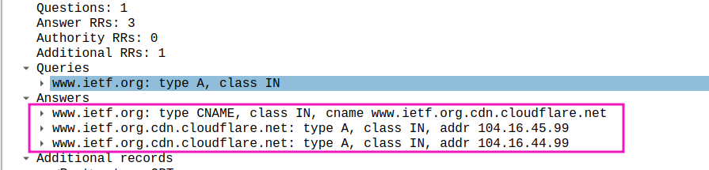
6. Consider the subsequent TCP SYN packet sent by your host. Does the destination IP address of the SYN packet correspond to any of the IP addresses provided in the DNS response message?
**yes，**`104.16.45.99`
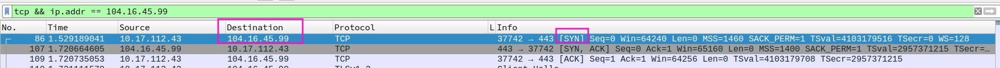
7. This web page contains images. Before retrieving each image, does your host issue new DNS queries?
**the images are all loaded from www.ietf.org, no DNS queries after initial query, since the DNS have cached in host. Note that application layer protocol is https here, so no http message shown in wireshark list window instead of TLS message**
>http not shown in wireshark
>HTTPS代表着在TLS上的HTTP，因此除非您拥有将TLS解密为明文所需的数据，否则Wireshark无法分析加密内容，因此数据包中识别到的最高层协议（也就是显示在数据包列表中作为协议类型）仍然是TLS。
##  3.4. play with nslookup
### 3.4.1 nslookup mit.edu
捕获成功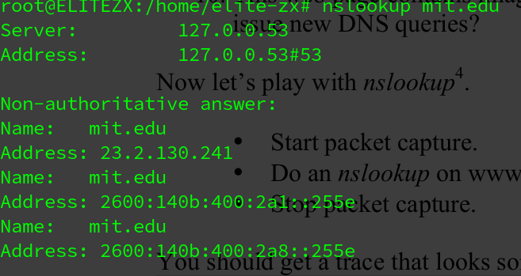

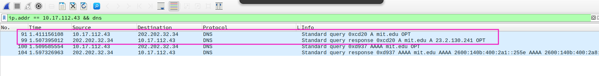
1. What is the destination port for the DNS query message? What is the source port of DNS response message?
**Dst port of query:** `53`
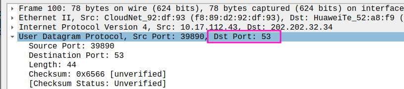
**Src port of response:**`53`
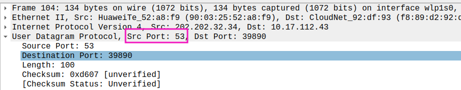
2. To what IP address is the DNS query message sent? Is this the IP address of your default local DNS server?
**yes**
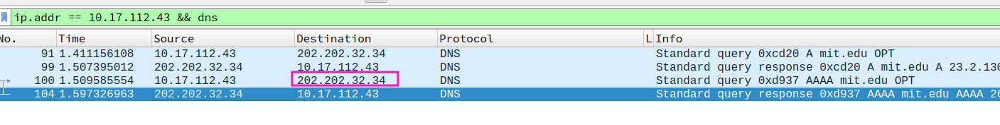
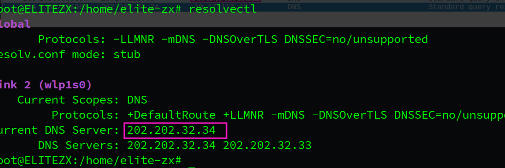
3. Examine the DNS query message. What “Type” of DNS query is it? Does the query message contain any “answers”?
**A, no answer**
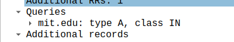
4. Examine the DNS response message. How many “answers” are provided? What do each of these answers contain?
**one,  an ip address, which is correspond to the answer of nslookup**
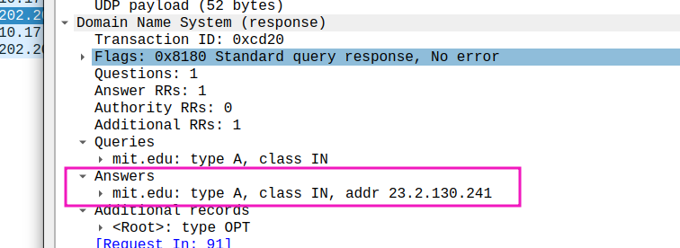
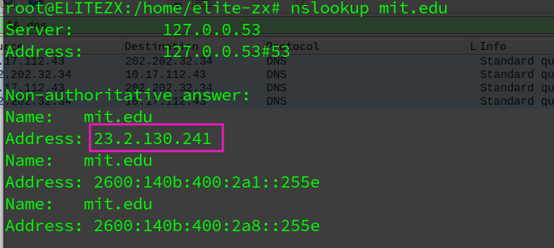
5. Provide a screenshot.
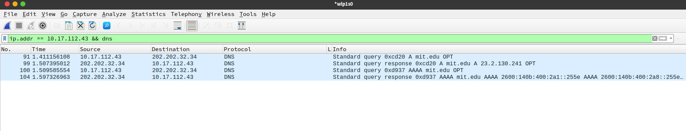
### 3.4.2 nslookup –type=NS mit.edu
捕获成功
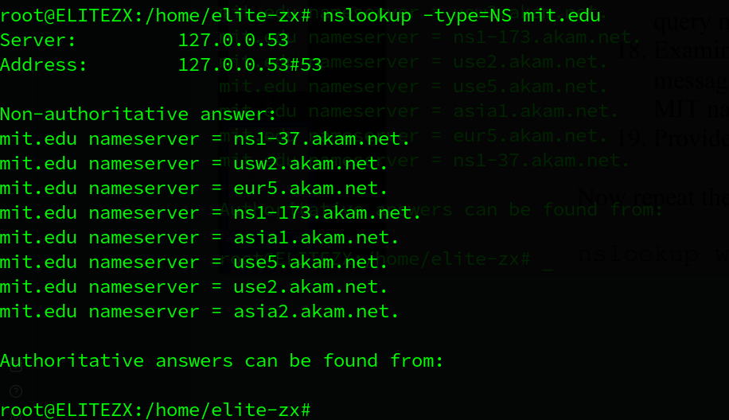
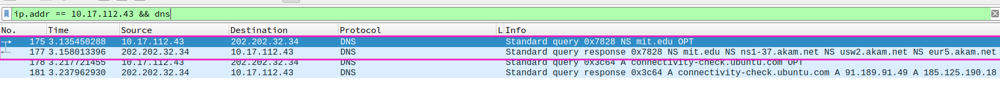
1. To what IP address is the DNS query message sent? Is this the IP address of your default local DNS server?
**yes,** `202.202.32.34`
2. Examine the DNS query message. What “Type” of DNS query is it? Does the query message contain any “answers”?
**NS， no answers** 
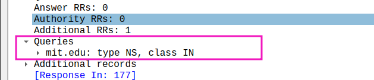
3. Examine the DNS response message. What MIT nameservers does the response message provide? Does this response message also provide the IP addresses of the MIT namesers?
**Exactly as listed by nslookup, even in the same order. no IP address in response**
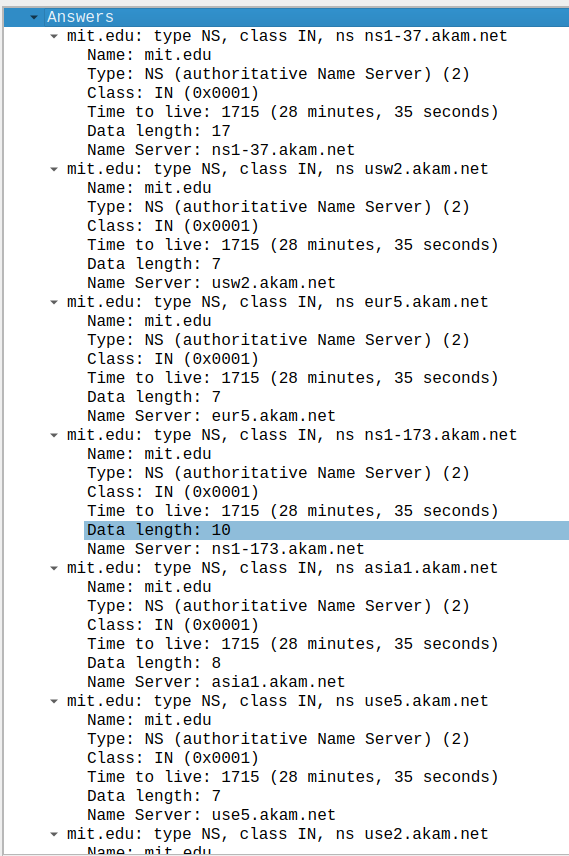
4. Provide a screenshot.
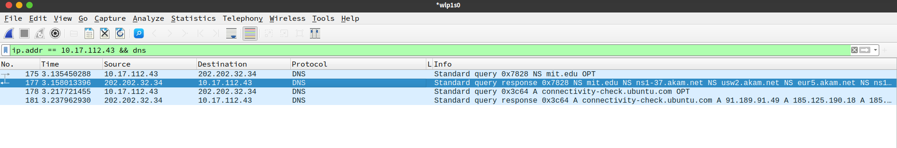
# lab4 UDP
1. Select one UDP packet from your trace. From this packet, determine how many fields there are in the UDP header. (You shouldn't look in the textbook! Answer these questions directly from what you observe in the packet trace.) Name these fields.
**4 fields : 源端口号src port number，目标端口号dst port number，报文段长度 length，检验和 checkSum**
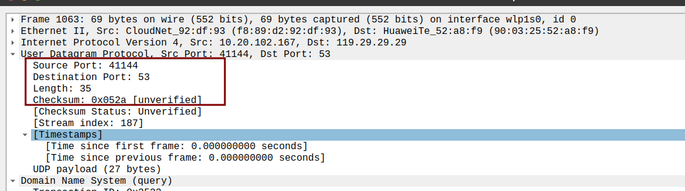
2. By consulting the displayed information in Wireshark's packet content field for this packet, determine the length (in bytes) of each of the UDP header fields
**Length - data part length (UDP payload)    = 8bytes, each of header fields have 2 bytes**
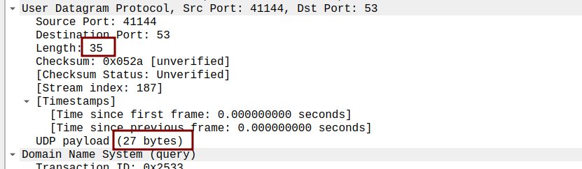
3. The value in the Length field is the length of what? (You can consult the text for this answer). Verify your claim with your captured UDP packet.
**header  + data part**
4. What is the maximum number of bytes that can be included in a UDP payload? (Hint: the answer to this question can be determined by your answer to 2. above)
**the size of length field is 16bits, which means maximum value is $2^{16}=65536$ , subtract header size(8 bytes) from the maximum, so the UDP payload maximum is $65536 - 8 = 65528$ bytes**
5. What is the largest possible source port number? (Hint: see the hint in 4.)
**the source port number size is 16bytes as well as dst port number size, so the answer is $2^{16}-1 = 65535$**
6.  What is the protocol number for UDP? Give your answer in both hexadecimal and decimal notation. To answer this question, you'll need to look into the Protocol field of the IP datagram containing this UDP segment (see Figure 4.13 in the text, and the discussion of IP header fields).
**17**
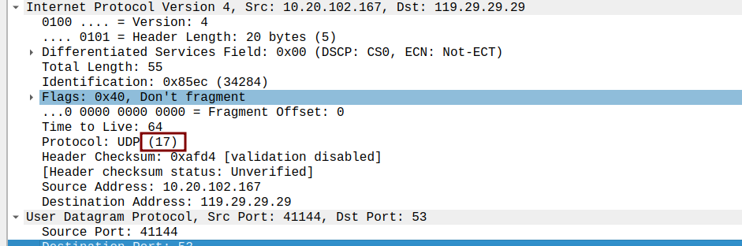
7. Examine a pair of UDP packets in which your host sends the first UDP packet and the second UDP packet is a reply to this first UDP packet. (Hint: for a second packet to be sent in response to a first packet, the sender of the first packet should be the destination of the second packet). Describe the relationship between the port numbers in the two packets.
**the first UDP package of sender**
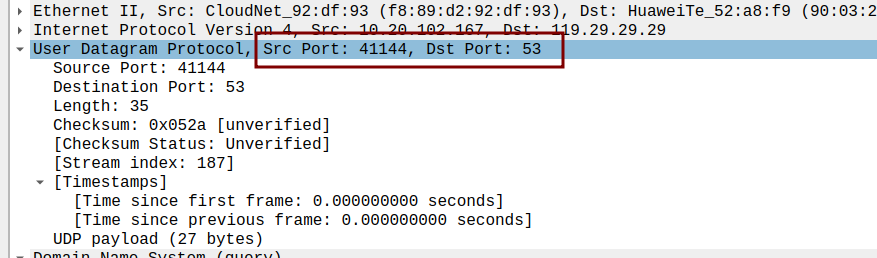
**the second UDP package of  receiver**
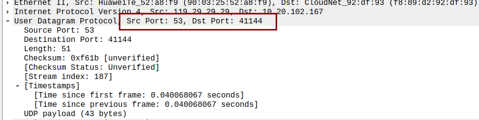
**The sending port and receiving port of the sender and receiver are exactly the opposite**
# lab5 TCP
捕获成功
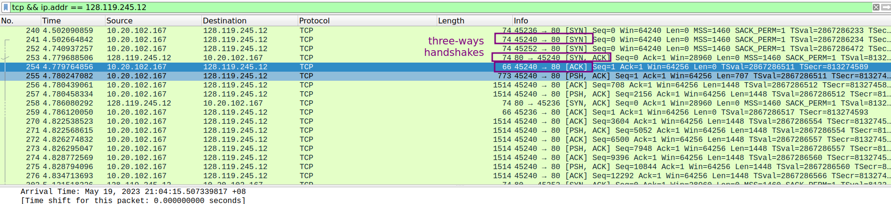
## 5.1 A first look at the captured trace
1. What is the IP address and TCP port number used by the client computer (source) that is transferring the file to gaia.cs.umass.edu? 
**src port: 45280,  dst port: 80**
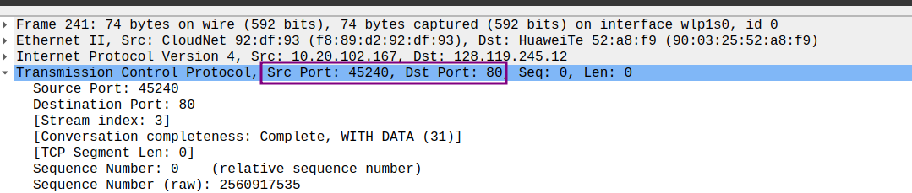
2. What is the IP address of gaia.cs.umass.edu? On what port number is it sending and receiving TCP segments for this connection?
**ip address:** `128.119.245.12`
**sending port number:** `80`
**receiving port number:** `80`, as well as sending port number
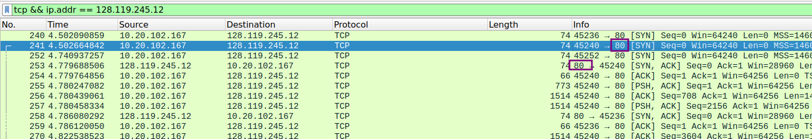
## 5.2 TCP Basics
1. What is the sequence number of the TCP SYN segment that is used to initiate the TCP connection between the client computer and gaia.cs.umass.edu? What is it in the segment that identifies the segment as a SYN segment?
**sequence number: 0**
**flag field of the segment identifies the segment is a SYN segment** 
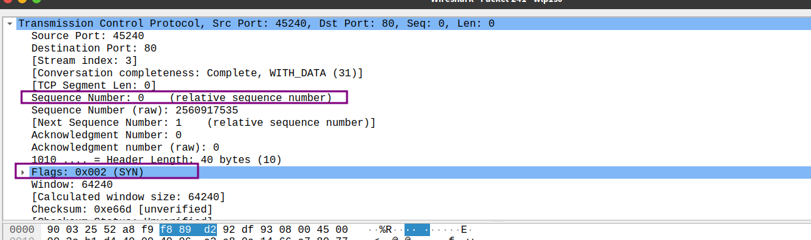
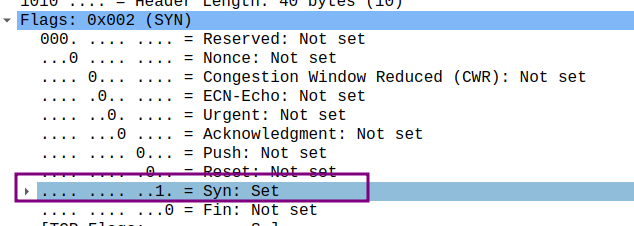
2. What is the sequence number of the SYNACK segment sent by gaia.cs.umass.edu to the client computer in reply to the SYN? What is the value of the Acknowledgement field in the SYNACK segment? How did gaia.cs.umass.edu determine that value? What is it in the segment that identifies the segment as a SYNACK segment?
- **sequence number: 0**
- **the value of ACKknowledgement field: 1**
- **确认字段的值是主机期望从对方收到的下一个字节的序号，在没有双方没有发送任何数据之前，双方的确认字段只能填入对方的第一个字节的序号，因此我主机发出的SYN在确认字段填入的是0，而对方主机发送的SYNACK是1（已接受我主机发出的序号为0的字节）**
- **flag field**
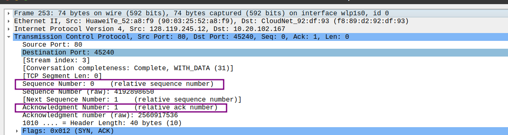
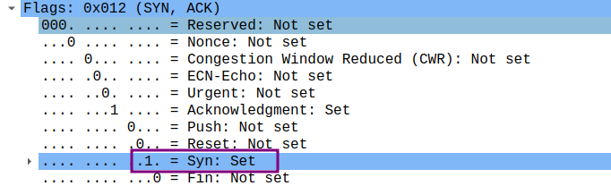
3. What is the sequence number of the TCP segment containing the HTTP POST command? Note that in order to find the POST command, you'll need to dig into the packet content field at the bottom of the Wireshark window, looking for a segment with a “POST” within its DATA field.1
**sequence number:** 1
**此时从我主机发出的HTTP顺带第3次握手的ACK信息，因此是下一个字节1**
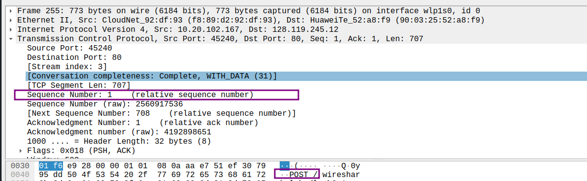
4. Consider the TCP segment containing the HTTP POST as the first segment in the TCP connection. What are the sequence numbers of the first six segments in the TCP connection (including the segment containing the HTTP POST)? At what time was each segment sent? When was the ACK for each segment received? Given the difference between when each TCP segment was sent, and when its acknowledgement was received, what is the RTT value for each of the six segments? What is the EstimatedRTT value (see Section 3.5.3, page 242 in text) after the receipt of each ACK? Assume that the value of the EstimatedRTT is equal to the measured RTT for the first segment, and then is computed using the EstimatedRTT equation on page 242 for all subsequent segments.
**这是是重新捕获了，因此发送端口从**`45240`**变成了**`48774`
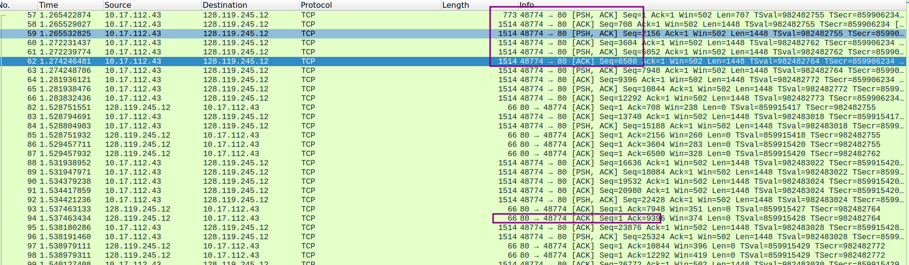
$$EstimatedRTT = (1-\alpha)*EstimatedRTT +\alpha * RTT (\alpha = 0.125)$$  

| seq num | sent time   | ack time          | RTT         | EstimatedRTT |
| ------- | ----------- | ----------------- | ----------- | ------------ |
| 1       | 1.265422874 | 1.528751551       | 0.263328677 | 0.263329     |
| 708     | 1.265529027 | 1.528752932       | 0.263223905 | 0.263316     |
| 2156    | 1.265532825 | 1.529457711       | 0.263924886 | 0.263392     |
| 3604    | 1.272231437 | 1.529457932(lose) | 0.257226495 | 0.262621     |
| 5052    | 1.272239774 | 1.529457932       | 0.257218158 | 0.261946     |
| 6500    | 1.274246481 | 1.537463133       | 0.263216652 | 0.262105     |

这里只拿一对发送-响应的截图来说明：
**发送segment1, 下一个字节序号为708, 因此接受方反馈的信息中确认字段应该填入708**
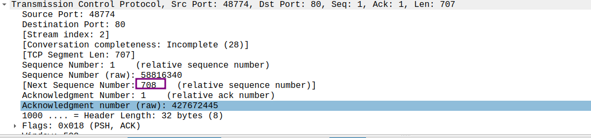

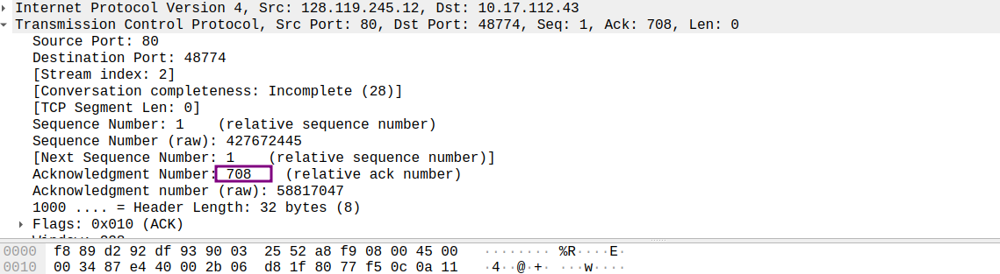
6. What is the length of each of the first six TCP segments?

| seq num | length |
| ------- | ------ |
| 1       | 707    |
| 708     | 1448   |
| 2156    | 1448   |
| 3604    | 1448   |
| 5052    | 1448   |
| 6500    | 1448   |
7. What is the minimum amount of available buffer space advertised at the received for the entire trace? Does the lack of receiver buffer space ever throttle the sender?
**最小的接受窗口应该是在连接刚建立的时候，即包含在SYN ACK信息中，大小为**`28960`
>在一个 TCP 连接建立时，由于通信双方还未知道网络的具体情况，例如链路速度、延迟、丢包率等，因此需要从较小的窗口大小开始，以避免突然发送大量的数据导致网络拥塞。这就是为什么在 TCP 连接建立的时候，接收窗口的大小会被设置得相对较小。
>
>当连接建立后，TCP 会通过观察网络的反馈（如接收端的 ACK，网络的延迟和丢包情况等）来动态调整窗口大小，这就是 TCP 的拥塞控制机制。如果网络条件良好，窗口会逐步增大，以提高传输效率。如果出现网络拥塞（如丢包），窗口会减小，以降低发送速率，避免拥塞的进一步发生。
>
>所以，TCP 连接刚建立的时候，窗口大小被设置得较小，主要是为了避免对未知网络条件的盲目冒进，防止过早导致网络拥塞，同时也为后续的窗口动态调整留下空间。

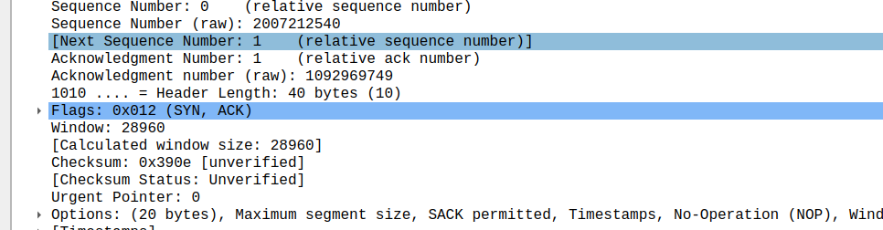
**接受窗口的大小远大于单个segment(1448 bytes), 并且随着发送的进行还在不断变大， 因此发送方没有因为接受窗口大小而抑制发送速率**
9. Are there any retransmitted segments in the trace file? What did you check for (in the trace) in order to answer this question?
**no retransimtted segments, the sequence of The sequence number of the segment sent by the sender is always incremented**, 
**这里是重新捕获后的截图，端口变为**`45802`
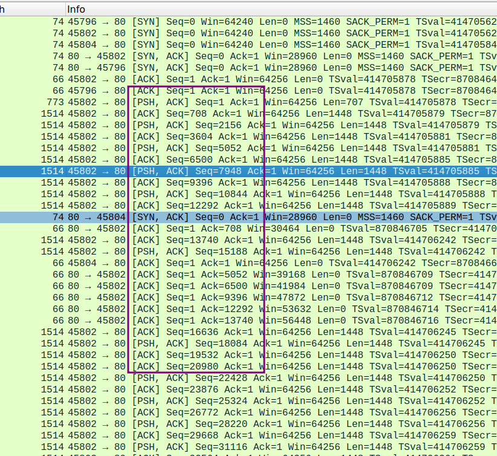
10. How much data does the receiver typically acknowledge in an ACK? Can you identify cases where the receiver is ACKing every other received segment u(每隔一个收到的段)(see Table 3.2 on page 250 in the text).
**两个连续的反馈信息中的ACK字段之差就表示了一个ACK确定的数据量，可以看到这里是**`1448` 
**下图中也存在这样的情况$9396 - 6500 = 2896$ , 这种就是间隔发送ACK的情况(case)**
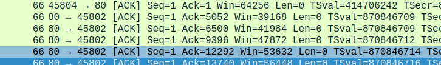
11. What is the throughput (bytes transferred per unit time) for the TCP connection? Explain how you calculated this value.
**通过第一个TCP数据段的序列号和最后一个确认的序列号之间的差来计算发送的总数据量**
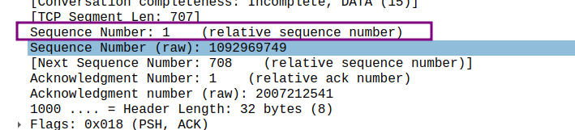
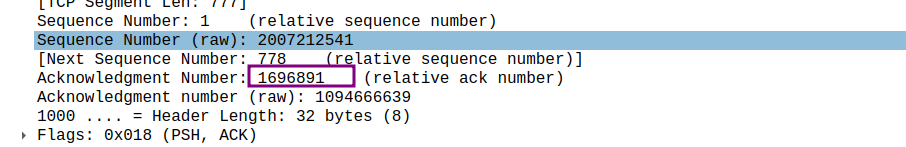
**因此总数据量为$1696891 - 1 = 1696890$ （头部信息加上文件数据），这很符合文件的大小

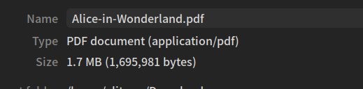
除去这期间的时间就可得到单位时间**$14.24178 -8.65656 = 5.58522$**的吞吐量**$1696890/5.58522 = 303,817.93376$ ， **即303kB/s (not KB)** 

