Programming Tasks Of Computer-Networking-A-TopDown-Approach
===
- [x] WebServer
- [x] UDPPing
- [x] SMTP-Client
- [x] Proxy-Server

- [x] ABP-RDT
- [x] GBN-RDT

# 1 lab0 WarmUp
## 1.1. UDP
1. UDPClient.py
```python
from socket import*
serverName = '127.0.0.1' # ip or hostname , if is hostname,automatically carry out DNS lookup to find correspond ip
serverPort = 12000 # designate destination port number
clientSocket = socket(AF_INET,SOCK_DGRAM);# create client socket(ipv4,udp), clientPort is automatically allocated by OS
message = input('Input lowercase sentence:')
# message content and destination address(server_ip,server_ port),the clientAddress automatically add to the message by OS     
clientSocket.sendto(message.encode(),(serverName,serverPort))
modifiedMessage, serverAddress = clientSocket.recvfrom(2048); # receive from server, 2048 is cache length
print(modifiedMessage.decode())
clientSocket.close()
```
2. UDPServer.py
```python
from socket import*
serverPort = 12000 # allocate server port number manually
serverSocket = socket(AF_INET,SOCK_DGRAM)# create server Socket(ipv4,udp)
serverSocket.bind(('',serverPort));# bind socket and port number, one socket one port number
print("The server is ready to receive")
while True:
    message,clientAddress = serverSocket.recvfrom(2048) # receive message from client
    modifiedMessage = message.decode().upper()
    print("done!")
    serverSocket.sendto(modifiedMessage.encode(),clientAddress)
```
3. result

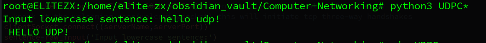
## 1.2. TCP
1. TCPClient.py
```python
from socket import*
serverName = '127.0.0.1' # local host
serverPort = 12000   # welcoming socket
clientSocket = socket(AF_INET, SOCK_STREAM)#clientPort is automatically allocated by OS
# knock at the welcoming door(welcomingsocket),this will initiate tcp three-way handshakes
clientSocket.connect((serverName,serverPort)) 
sentence=input('Input lowercase sentence:')
clientSocket.send(sentence.encode()) # send message without server addree,since tcp connection is built
modifiedSentence = clientSocket.recv(1024)
print(modifiedSentence.decode())
clientSocket.close()
```
2. TCPServer.py
```python
from socket import*
serverPort = 12000 # welcoming socket
serverSocket = socket(AF_INET,SOCK_STREAM)
serverSocket.bind(('',serverPort))
serverSocket.listen(1) # maximal connection number(at least 1)
print('The server is ready to receive')
while True:
    connectionSocket, addr = serverSocket.accept() # create a new socket(connectionSocket) which is delicated to client
    sentence = connectionSocket.recv(1024).decode() # receive message from connectionSocket
    capitalizedSentence = sentence.upper()
    print("done!")
    connectionSocket.send(capitalizedSentence.encode())
    connectionSocket.close()
```
3. result
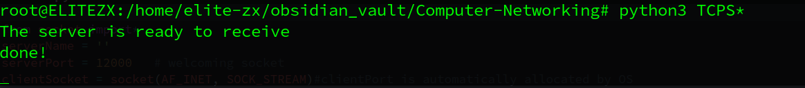
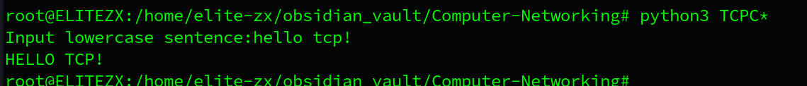
# lab1  Web-Server
## 2.1. Web-Server.py
```python
#import socket module
from socket import *
import sys # In order to terminate the program
serverSocket = socket(AF_INET, SOCK_STREAM)
#Prepare a sever socket
#Fill in start
serverPort = 80 # allocate server port number manually
serverSocket.bind(('',serverPort))
serverSocket.listen(10) # maximal connection number
#Fill in end
while True:
    #Establish the connection
    print('Ready to serve...')
    #Fill in start
    connectionSocket, addr = serverSocket.accept() ## create a new socket(connectionSocket) which is delicated to client
    #Fill in end
    try:
        #Fill in start
        message = connectionSocket.recv(1024); # receive message from connectionSocket
        #Fill in end
        filename = message.split()[1] # get filename from string list message
        f = open(filename[1:])
        #Fill in start
        outputdata = f.read()
        #Fill in end
        #Send one HTTP header line into socket
        #Fill in start
        header = 'HTTP/1.1 200 OK\r\nConnection: close\r\nDate: Tue, 23 May 2023 11:14:01 GMT\r\nContent-Type: text/html\r\nContent-Length: %d\r\n\r\n' % (len(outputdata)) # Comply with the HTTP response message format
        connectionSocket.send(header.encode()) 
        #Fill in end
        #Send the content of the requested file to the client
        for i in range(0, len(outputdata)):
            connectionSocket.send(outputdata[i].encode())
        connectionSocket.send("\r\n".encode())
        connectionSocket.close()
    except IOError:
        #Send response message for file not found
        #Fill in start
        header = 'HTTP/1.1 404 Not Found'
        connectionSocket.send(header.encode()) 
        #Fill in end
        #Close client socket
        #Fill in start
        #Fill in end
        serverSocket.close()
        #Fill in end
serverSocket.close()
sys.exit()#Terminate the program after sending the corresponding data

```
使用以下命令可以检查端口号80是否被占用
```bash
netstat -tuln | grep :8080
```
HelloWorld.html放在Web-Server.py同目录下，内容如下：
```html
<span style="color: green; font-size: 36px;">Hello,World! This is Elite-zx web server</span>
```
## 2.2. result
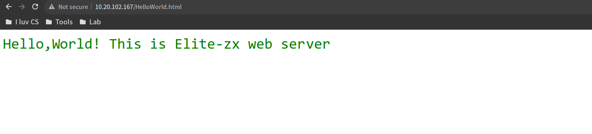
# lab3 UDPPinger
## 3.1. UDPPingerClient.py
```python
from socket import*
import time 

serverName = '127.0.0.1'
serverPort = 12000
clientSocket = socket(AF_INET,SOCK_DGRAM);
clientSocket.settimeout(1)  # timeout is 1 second 

for i in range(0,10):
    sendTime = time.time() 
    message =('Ping %d %s' % (i+1,sendTime)).encode()
    try:
        clientSocket.sendto(message,(serverName,serverPort))
        modifiedMessage, serverAddress = clientSocket.recvfrom(2048)
        rtt = time.time() - sendTime
        print('Sequence %d: RTT = %.3fs  Reply from %s' % (i+1,rtt,serverName))
    except Exception: # time out Exception, socket.timeout is not from BaseException
        print('Sequence %d: Request timed out' % (i+1))

clientSocket.close()
```
## 3.2. UDPPingerServer.py
```python
# We will need the following module to generate randomized lost packets
import random
from socket import *
# Create a UDP socket
# Notice the use of SOCK_DGRAM for UDP packets
serverSocket = socket(AF_INET, SOCK_DGRAM)
# Assign IP address and port number to socket
serverSocket.bind(('', 12000))
while True:
    # Generate random number in the range of 0 to 10
    rand = random.randint(0, 10)
    # Receive the client packet along with the address it is coming from
    message, address = serverSocket.recvfrom(1024)
    # Capitalize the message from the client
    message = message.upper()# If rand is less is than 4, we consider the packet lost and do not respond
    if rand < 4:
        continue
    # Otherwise, the server responds
    serverSocket.sendto(message, address)
```
## 3.3. result
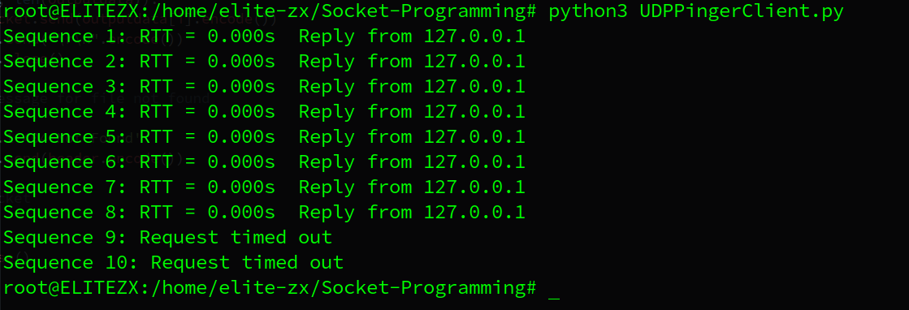
# lab4 SMTP-Client
## 4.1. SMTP-MailClient.py
这里访问的是Gmail的服务器，因此多了2个额外的步骤
- 建立TLS (Transport Layer Security) 连接，为了加密
- 在Google账户中开启双重验证，为Gmail设置单独的密码，直接用Google账户的密码AUTH LOGIN，Gmail服务器不认的，会返回`535-5.7.8 Username and Password not accepted`。如果账户密码正确，则返回`235 2.7.0 Accepted`
注意账户密码使用base64编码，这可以通过`base64.b64encode`函数做到
```python
from socket import *
import base64
import ssl

msg = "\r\n Elite-ZX love computer networks!"
endmsg = "\r\n.\r\n"
# Choose a mail server (e.g. Google mail server) and call it mailserver
#Fill in start
mailServer = 'smtp.gmail.com'
mailPort = 587
fromAddress = '********@gmail.com'
toAddress = '********@qq.com'
username = base64.b64encode(b'********@gmail.com').decode()
password = base64.b64encode(b'********').decode()
#Fill in end
# Create socket called clientSocket and establish a TCP connection with mailserver
#Fill in start
clientSocket = socket(AF_INET,SOCK_STREAM)
clientSocket.connect((mailServer,mailPort))
#Fill in end
recv = clientSocket.recv(1024).decode()
print(recv)
if recv[:3] != '220':
    print('220 reply not received from server.')

# Send HELO command and print server response.
heloCommand = 'HELO Elite-zx\r\n'
print(heloCommand)
clientSocket.send(heloCommand.encode())
recv1 = clientSocket.recv(1024).decode()
print(recv1)
if recv1[:3] != '250':
    print('250 reply not received from server.')

# Send STARTTLS command and print server response
clientSocket.send(('STARTTLS\r\n').encode())
recv = clientSocket.recv(1024).decode()
print(recv)
if recv[:3] != '220':
    print('220 reply not received from server.')

# Create TLS connection
context = ssl.create_default_context()
clientSocket = context.wrap_socket(clientSocket, server_hostname='smtp.gmail.com')

# Send AUTH LOGIN command 
authLoginCommand='AUTH LOGIN\r\n'
clientSocket.send(authLoginCommand.encode())
recv = clientSocket.recv(1024).decode()
print(recv)
if (recv[:3] != '334'):
	print('334 reply not received from server')
# Send username
clientSocket.send((username+'\r\n').encode())
recv = clientSocket.recv(1024).decode()
print(recv)
if (recv[:3] != '334'):
	print('334 reply not received from server')
# Send password 
clientSocket.send((password+'\r\n').encode())
recv = clientSocket.recv(1024).decode()
print(recv)
if (recv[:3] != '235'):
	print('235 reply not received from server')

# Send MAIL FROM command and print server response.
# Fill in start
print('MAIL FROM: <' + fromAddress + '>\r\n')
clientSocket.send(('MAIL FROM: <' + fromAddress + '>\r\n').encode())
recv2 = clientSocket.recv(1024).decode()
print(recv2)
if recv2[:3] != '250':
    print('250 reply not received from server.')
# Fill in end

# Send RCPT TO command and print server response.
# Fill in start
print('RCPT TO: <'+ toAddress + '>\r\n')
clientSocket.send(('RCPT TO: <'+ toAddress + '>\r\n').encode())
recv3 = clientSocket.recv(1024).decode()
print(recv3)
if recv3[:3] != '250':
    print('250 reply not received from server.')
# Fill in end

# Send DATA command and print server response.
# Fill in start
DataCommand = 'DATA\r\n'
clientSocket.send(DataCommand.encode())
recv4 = clientSocket.recv(1024).decode()
print(recv4)
if recv4[:3] != '354':
    print('354 reply not received from server.')
# Fill in end

# Send message data.
# Fill in start
clientSocket.send(msg.encode())
# Fill in end

# Message ends with a single period.
# Fill in start
clientSocket.send(endmsg.encode())
recv5 = clientSocket.recv(1024).decode()
print(recv5)
if recv5[:3] != '250':
    print('250 reply not received from server.')
# Fill in end

# Send QUIT command and get server response.
# Fill in start
QuitCommand = 'QUIT\r\n'
clientSocket.send(QuitCommand.encode())
recv6 = clientSocket.recv(1024).decode()
print(recv6)
if recv6[:3] != '221':
    print('221 reply not received from server.')
# Fill in end
```
## 4.2. result
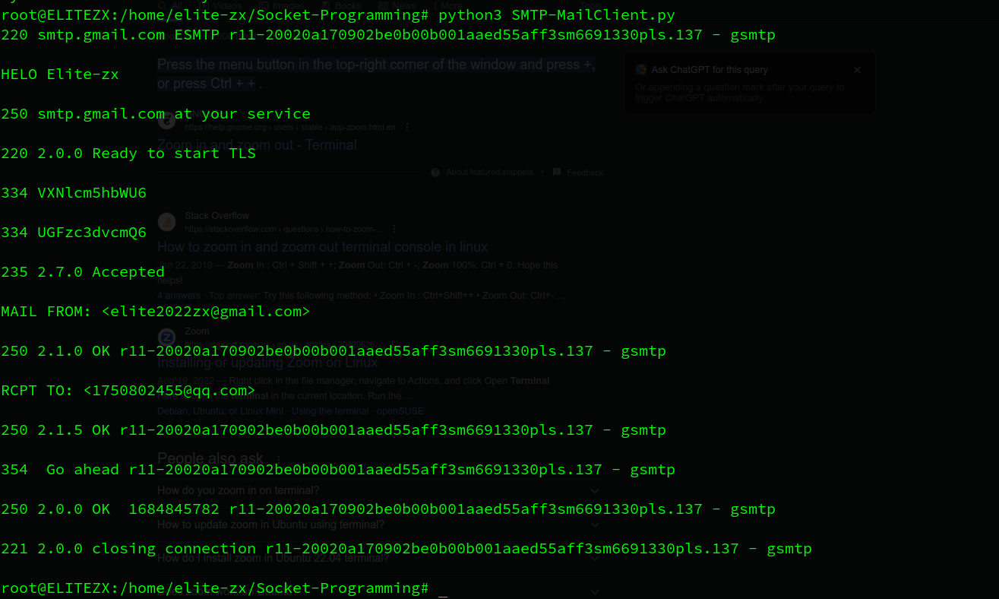
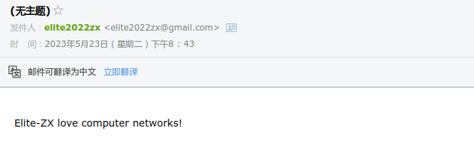
# lab5 ProxyServer
## 5.1. setback road
这个实验我踩了很多坑，一来是因为文档给出的源码与python3有很多不合的地方，二来网上没有很好的参考，包括[github上热度很高的那个参考](https://github.com/moranzcw/Computer-Networking-A-Top-Down-Approach-NOTES/blob/master/SocketProgrammingAssignment/%E4%BD%9C%E4%B8%9A4-%E5%A4%9A%E7%BA%BF%E7%A8%8BWeb%E4%BB%A3%E7%90%86%E6%9C%8D%E5%8A%A1%E5%99%A8/%E4%BD%9C%E4%B8%9A4-%E5%A4%9A%E7%BA%BF%E7%A8%8BWeb%E4%BB%A3%E7%90%86%E6%9C%8D%E5%8A%A1%E5%99%A8-%E8%A7%A3%E7%AD%94.md)对我也不可行。因此我靠着添加try-except语句，stackoverflow以及chatgpt的分析，花了一个五六个小时总算是做出来了。
下面我将列举我踩的坑
- 端口80默认绑定到http协议，因此访问https的网站将被拒绝连接。大多数网站即使你的URL是http还是会给你重定向到https，因此建议使用http://gaia.cs.umass.edu/wireshark-labs/INTRO-wireshark-file1.html进行结果测试，文档里提到的www.google.com怕是不可行吧🤨
- 关于split和partition的使用，目的是在URL中提取出源服务器gaia.cs.umass.edu和目标文件路径wireshark-labs/INTRO-wireshark-file1.html，要根据你访问的网站做调整
- send函数内的参数均要加上用encode()处理，使参数从字符流变成字节流，否则会抛出`a bytes-like object is required, not 'str'`的异常
- `makefile()`函数返回一个与socket关联的文件对象，这里应该使用`fileobj = c.makefile('rw',None)`，则不是文档里的`fileobj = c.makefile('r', 0)`，首先参数0是python2中的，在python3已被替换为None, 而且如果用只读模式打开，后续write将会抛出不可写入的异常
- `fileobj.write("GET /".encode()+ filename.encode() + " HTTP/1.0\r\n\r\n".encode())`的执行迟迟不结束，原来是发送的http请求先被放入了内部缓冲区等待发送，添加`fileobj.flush() `刷新缓冲区，立即发送请求
- 一开始参考了github上的代码直接转发message即`c.sendall(message.encode())`，可是浏览器总是会先发出先自动`GET /favicon.ico HTTP/1.1`的请求，查阅stackflow后，这个行为要修改html头部才能避免，因此只能采用文档提供的方法即自己构造HTTP请求（虽然浏览器在该请求之后还是会自动发出`GET /favicon.ico HTTP/1.1`请求😕）
-  因为目标路径文件包含一个子目录，因此要先在代理服务器下创建一个wireshark-labs的文件夹以避免`tmpFile = open("./" + filename,"wb")`抛出子目录不存在的异常）
## 5.2 ProxyServer.py
```python
from socket import *
import sys
if len(sys.argv) <= 1: # get listening port
    print('Usage : "python ProxyServer.py listening_port"\n[server_ip : It is the listening\
            port of Proxy Server')
    sys.exit(2)
# Create a server socket, bind it to a port and start listening
tcpSerSock = socket(AF_INET, SOCK_STREAM)
# Fill in start.
tcpSerPort = int(sys.argv[1])
tcpSerSock.bind(('',tcpSerPort))
tcpSerSock.listen(6)
# Fill in end.
while 1:
    # Start receiving data from the client
    print('Ready to serve...')
    tcpCliSock, addr = tcpSerSock.accept()
    print('Received a connection from: ', addr)
    # Fill in start.
    message = tcpCliSock.recv(2048).decode()
    # Fill in end.
    print("message content: " , message)
    # Extract the filename from the given message
    print("URL: ", message.split()[1])
    filename = message.split()[1].partition("/")[2].partition("/")[2]
    print("filename: " , filename)
    fileExist = "false"
    # print(filetouse)
    try:# Check wether the file exist in the cache
        f = open(filename, "r")
        outputdata = f.readlines()
        fileExist = "true"
        print("Target file exist!")
        # ProxyServer finds a cache hit and generates a response message
        tcpCliSock.send("HTTP/1.0 200 OK\r\n".encode())
        tcpCliSock.send("Content-Type:text/html\r\n".encode())
        # Fill in start.
        # send file content
        for i in range(0,len(outputdata)):
            tcpCliSock.send(outputdata[i].encode())
        # Fill in end.
        print('Read from cache')
    # Error handling for file not found in cache
    except IOError:
        if fileExist == "false":
            print("Target file no exist!")
            # Create a socket on the proxyserver
            # Fill in start.
            c = socket(AF_INET, SOCK_STREAM)
            # Fill in end.
            hostn = message.split()[1].partition("/")[2].partition("/")[0].replace("www.","",1) # remove www. get hostname
            print("source server host: " , hostn )
            try:
                # Connect to the socket to port 80
                # Fill in start.
                c.connect((hostn,80))
                print("proxy server's socket connected to source server!")
                # Fill in end.
                # Create a temporary file on this socket and ask port 80
                # for the file requested by the client
                #print("will open fileobj!")
                #try:
                fileobj = c.makefile('rw',None)
                #except Exception as e:
                #    print("Exception occurred while making file:", str(e))

                print("open fileobj!")
                # approach + url + version of http + empty line + empty header
                try:
                    number = fileobj.write("GET ".encode()+ filename.encode() + " HTTP/1.0\r\n\r\n".encode())
                    print(number)
                    fileobj.flush() # Send immediately, do not wait
                except Exception as e:
                    print("Exception occurred while writing file:", str(e))
                print("requested sent to source server!")

                # Read the response into buffer
                # Fill in start.
                #c.sendall(message.encode())
                #buff = c.recv(2048)
                buffer = fileobj.read()
                tcpCliSock.sendall(buffer)
                print("buffer is ready!")
                # Fill in end.
                
                # Create a new file in the cache for the requested file.
                tmpFile = open("./" + filename,"wb")
                # Fill in start.
                tmpFile.write(buffer)
                tmpFile.close()
                # Fill in end.
            except Exception as e:
                print("Exception: ", str(e))
                print("Illegal request")
        else:
            # HTTP response message for file not found
            # Fill in start.
            tcpCliSock.send("HTTP/1.1 404 Not Found\r\n\r\n".encode())
            print('File Not Found')
            # Fill in end.
    # Close the client and the server sockets
    tcpCliSock.close()
# Fill in start.
tcpSerSock.close()
# Fill in end.   
```
## 5.3.result 
首次访问proxy server
http://localhost:8080/gaia.cs.umass.edu/wireshark-labs/INTRO-wireshark-file1.html
代理服务器上没有目标文件，因此它向源服务器发出请求，在得到文件后转发给client并缓存目标文件在代理服务器本地
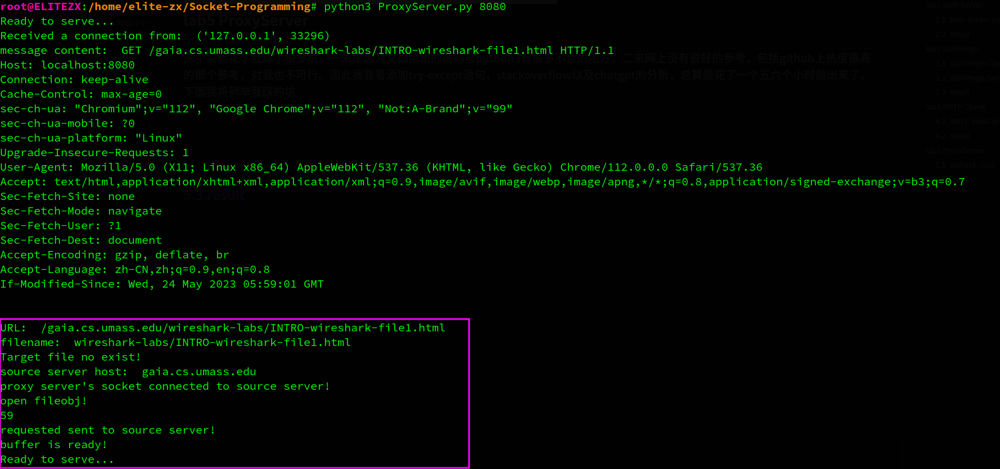
client端获取成功

此时wireshark-labs目录下已经多了一个缓存文件
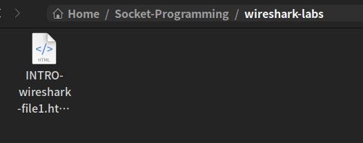
再次访问proxy server，可以看到代理服务器直接返回了已缓存的文件
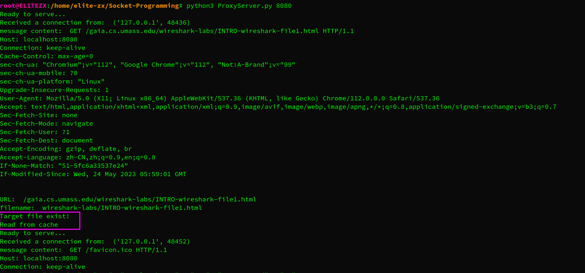
client端获取成功
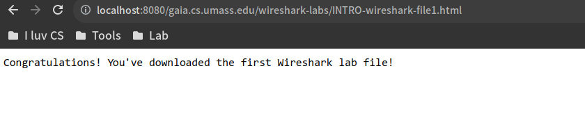

# Reliable Transport Protocol
_Tell me and I forget. Show me and I remember. Involve me and I understand._
## 1. Stop And Wait / Alternating-Bit
我实现的版本更像是rdt3.0，没有使用NAK，而是通过为ACK编号让接受方判断是否收到了正确的反馈信息，只要在接受方B没有收到目标packet时在ack_packet的acknum字段填入上次收到的packet序号即可。因为B反馈的ack_packet没有要求装入数据，因此ack_packet的payload字段为空，那么相应的checksum字段也不需要加上payload了，ack_packet的seqnum在该协议中没有约束。

为网络模拟器版本纠错，把exit()改成exit(0)
实验开始前，阅读文档提供的[问答](http://gaia.cs.umass.edu/kurose/transport/programming_assignment_QA.htm)可以解决一些你的疑惑

### 1.1 analyze
发送方FSM，用A_status的4个值表示4种状态
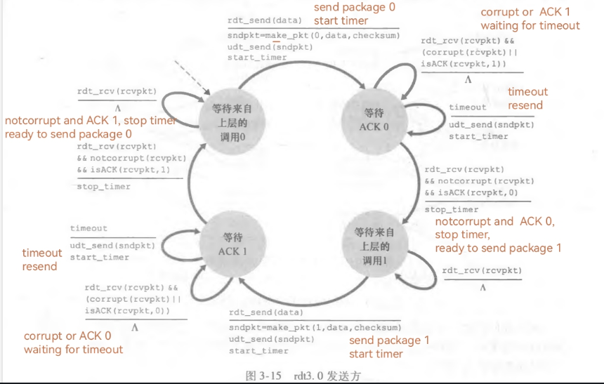
接受方的FSM，用B_status的2个值表示2种状态
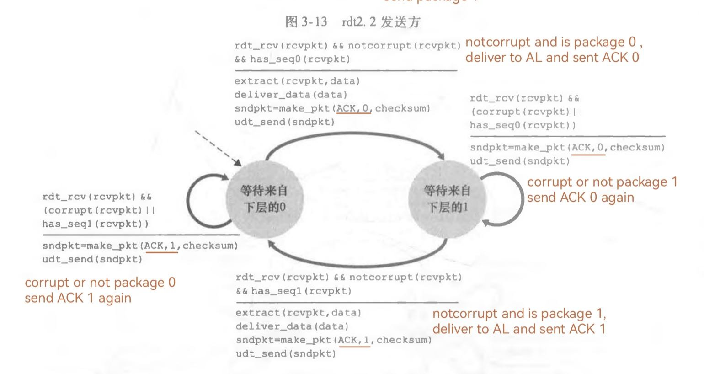
### 1.2. source code
```c
#include <stdio.h>
#include <string.h>

/* ******************************************************************
 ALTERNATING BIT AND GO-BACK-N NETWORK EMULATOR: VERSION 1.1  J.F.Kurose

   This code should be used for PA2, unidirectional or bidirectional
   data transfer protocols (from A to B. Bidirectional transfer of data
   is for extra credit and is not required).  Network properties:
   - one way network delay averages five time units (longer if there
     are other messages in the channel for GBN), but can be larger
   - packets can be corrupted (either the header or the data portion)
     or lost, according to user-defined probabilities
   - packets will be delivered in the order in which they were sent
     (although some can be lost).
**********************************************************************/

#define BIDIRECTIONAL 0 /* change to 1 if you're doing extra credit */
                        /* and write a routine called B_output */

int sndPkt_seq;  // 0,1,0,1...
int A_status;    // 4 status in FSM rdt3.0, 0 is iniital status
int B_status;    // 2 status in FSM rdt2.2, waiting for packet 0 or 1
/* a "msg" is the data unit passed from layer 5 (teachers code) to layer  */
/* 4 (students' code).  It contains the data (characters) to be delivered */
/* to layer 5 via the students transport level protocol entities.         */
struct msg {
    char data[20];
};

/* a packet is the data unit passed from layer 4 (students code) to layer */
/* 3 (teachers code).  Note the pre-defined packet structure, which all   */
/* students must follow. */
struct pkt {
    int seqnum;
    int acknum;
    int checksum;
    char payload[20];
};
struct pkt cachedPkt;

/********* STUDENTS WRITE THE NEXT SEVEN ROUTINES *********/

/* called from layer 5, passed the data to be sent to other side */
A_output(message) struct msg message;
{
    if (A_status == 1 || A_status == 3) {
        printf("sender A is waiting for ACK!\n");
        return -1;  // waiting for ACK;
    }
    struct pkt sndPkt;
    /*make_Pkt*/
    sndPkt.seqnum = sndPkt_seq % 2;
    sndPkt.acknum = -1;  // not a ACKnowledged package
    sndPkt.checksum = sndPkt.seqnum + sndPkt.acknum;
    for (int i = 0; i < 20; ++i) sndPkt.checksum += message.data[i];
    memcpy(sndPkt.payload, message.data, sizeof(message.data));
    printf("A is sending packet %d !\n", sndPkt.seqnum);
    /*cache_pkt*/
    cachedPkt = sndPkt;
    /*udt_send(sndPKt)*/
    tolayer3(0, sndPkt);
    /*start timer*/
    starttimer(0, 12.0);
    /*switch status of A*/
    ++A_status;
    ++sndPkt_seq;
}

B_output(message) /* need be completed only for extra credit */
    struct msg message;
{}

/* called from layer 3, when a packet arrives for layer 4 */
A_input(packet) struct pkt packet;
{
    if (A_status == 0 || A_status == 2) return -1;  // incorrect status
    int tmp_checksum = packet.acknum + packet.seqnum;
    /*no payload of ack packet*/
    /* notcorrupt and is target ACK*/
    if (tmp_checksum == packet.checksum && cachedPkt.seqnum == packet.acknum) {
        printf("ACK %d packet  is not corrupt!\n", packet.acknum);
        /* stop timer*/
        stoptimer(0);
        A_status = (++A_status) % 4;
    } else {
        printf("corrupt or not target ACK %d! will timeout and retransmit!\n",
               cachedPkt.seqnum);
        return -1;  // corrupt or is not target ack ,waiting for timeout
    }
}

/* called when A's timer goes off */
A_timerinterrupt() {
    printf("sender A is retransmiting packet %d !\n", cachedPkt.seqnum);
    /*udt_send*/
    tolayer3(0, cachedPkt);
    /*start timer*/
    starttimer(0, 12.0);
}

/* the following routine will be called once (only) before any other */
/* entity A routines are called. You can use it to do any initialization */
A_init() {
    sndPkt_seq = 0;
    // initial status of sender A---waiting for message from layer5
    A_status = 0;
}

/* Note that with simplex transfer from a-to-B, there is no B_output() */

/* called from layer 3, when a packet arrives for layer 4 at B*/
B_input(packet) struct pkt packet;
{
    struct pkt ack_packet;
    int tmp_checksum = packet.acknum + packet.seqnum;
    for (int i = 0; i < 20; ++i) tmp_checksum += packet.payload[i];
    /* notcorrupt and is target packet*/
    ack_packet.seqnum = packet.seqnum;
    if (tmp_checksum == packet.checksum && B_status == packet.seqnum) {
        printf("notcorrupt and target packet %d! sending right ACK!\n",
               packet.seqnum);
        /*extract*/
        struct msg extract_msg;
        memcpy(extract_msg.data, packet.payload, sizeof(packet.payload));
        /*deliver_data*/
        tolayer5(1, extract_msg);

        ack_packet.acknum = B_status;
        ack_packet.checksum =
            ack_packet.seqnum + ack_packet.acknum;  // no payload
        /*make_Pkt*/
        tolayer3(1, ack_packet);
        B_status = (++B_status) % 2;  // switch B status
    } else {
        printf("corrupt or not target packet! sending last receiving ACK!\n");
        ack_packet.acknum = (B_status + 1) % 2;
        ack_packet.checksum =
            ack_packet.seqnum + ack_packet.acknum;  // no payload
        tolayer3(1, ack_packet);
    }
}

/* called when B's timer goes off */
B_timerinterrupt() {}

/* the following rouytine will be called once (only) before any other */
/* entity B routines are called. You can use it to do any initialization */
B_init() { B_status = 0; }
```
###  1.2. result
####  2.1. no loss and corruption
一来一回，运行正常， packet 0与ack 0对应，packet 1与ack 1对应
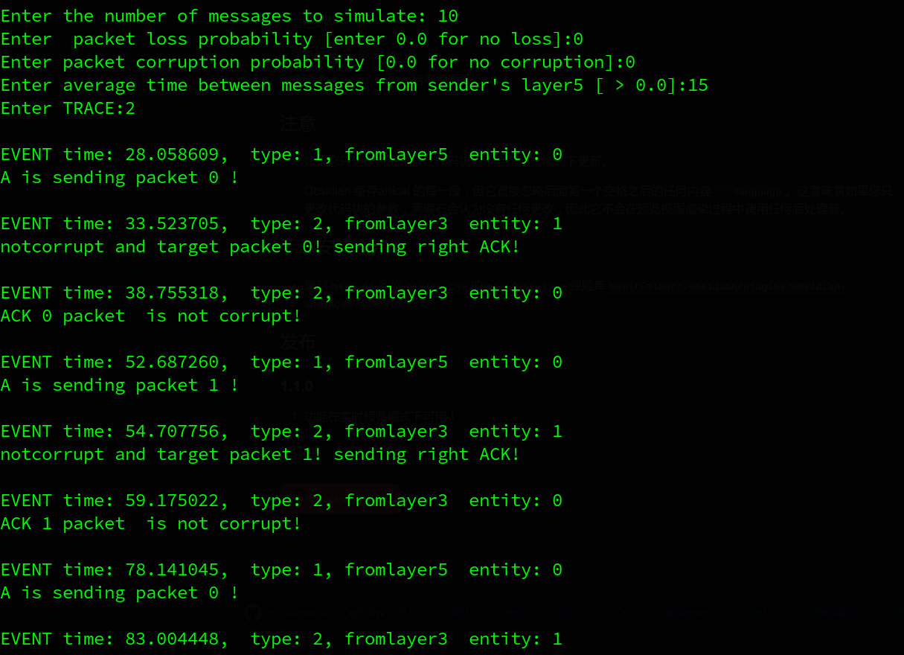
#### 2.2 loss and corruption
虽然只设置了0.2的丢包率和损失率，但是实际上概率还是挺大的，可能是随机数生成器的问题，下面将分析部分输出来验证代码的正确性

A先发送packet0, B成功接受了packet0,但是反馈信息在layer3中被损坏，A收到损坏的ack信息后等待超时重传，重传2次的2个包都丢了，接着超时重传，发出的包又损坏了(这也太频繁了)，期间A收到来自上层layer5的数据包，但是由于这是stop and wait协议，在收到发出的包的确认之前不能发送新的包，因此A只打印它在等待ack的信息。B端收到A重传的数据包，发现这不是它想要的数据包，而是冗余的数据包，因此它丢弃该包（不上传到layer5），并重新对这个序号（最后一次成功收到的序号）的包发出确认，A端收到想要的确认后，发出packet 1
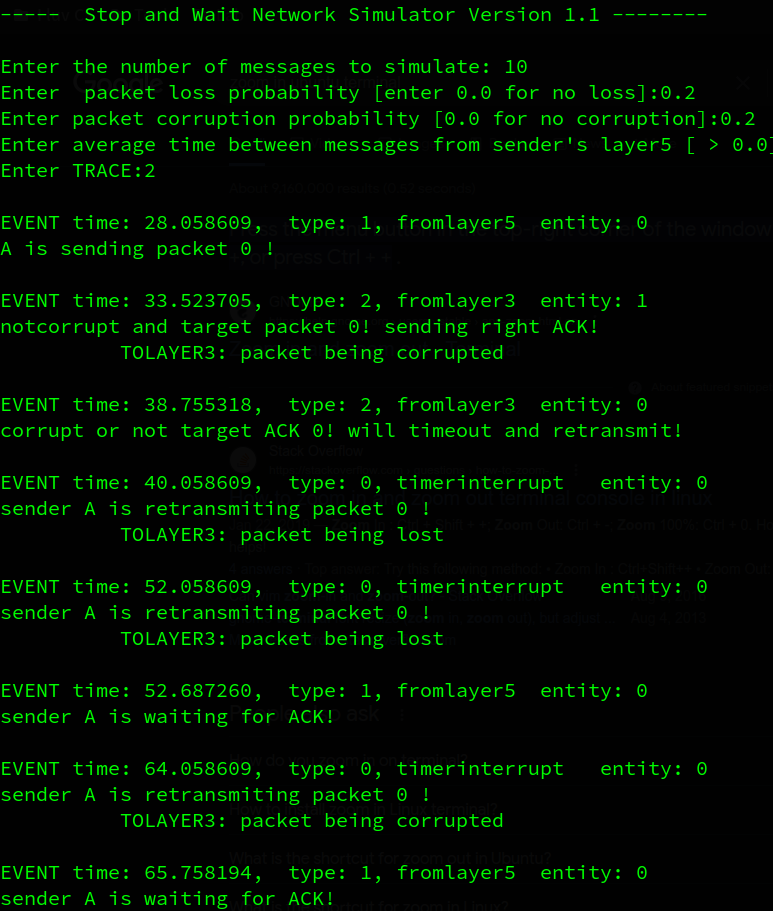
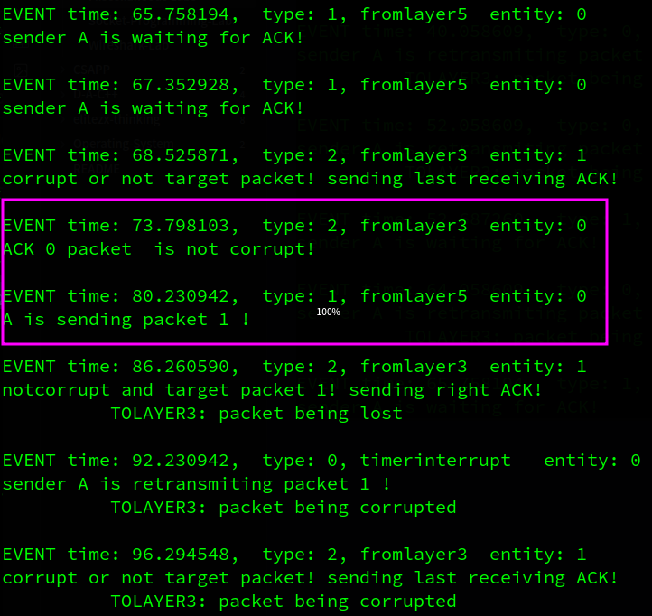
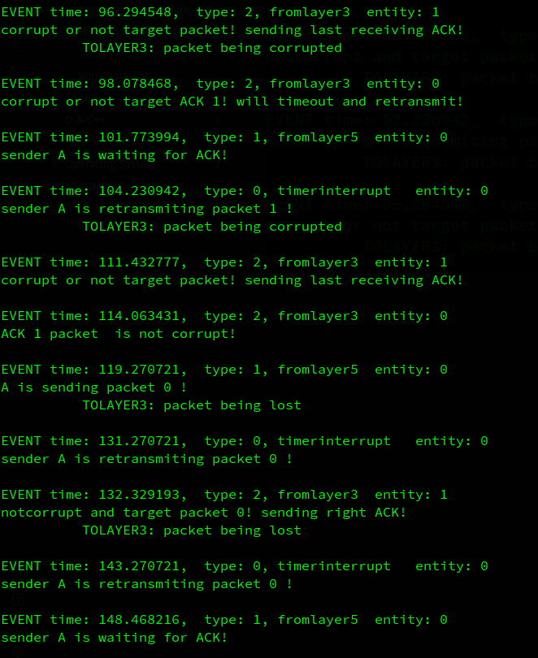
## 2. Go-Back-N
### 2.1 analyze
基于任务1, 完成GBN版本是比较轻松的，编写加调试只花了3个小时。接受方只需维护接受到**最后有序packet的序号last_rcv_seq**即可，在收到失序的重复的packet时发出包含last_rcv_seq的ACK即可告诉发送方自己可以确认了包含last_rcv_seq之前的所有包。因为存在ack到达之前，发送方超时重传的现象，因此发送方可能会收到冗余的ack信息，因此要设置一个acknum小于base的分支

发送方维护base和nextseq两个变量以表示window的发送边界，base表示窗口内最早发送但是未确认的序号（最右侧，窗口左移），nextseq表示下一个待发送的序号。因此当base = nextseq时，说明此时窗口内已经的packet均是待发送状态，此时只需要停止计时器，等待发送后启动计时器

注意这期间只有唯一的计时器，该计时器在窗口移动时重新记时
发送方FSM与接受方FSM：
纠正下图的"如果下一个分组未发送"$\rightarrow$ "如果窗口内的包均被确认`base == nextsequm`，则停止计时器，此时窗口内均是未发送的包，见下图 ，否则说明窗口内还有发送但未确认的包，重开计时器"
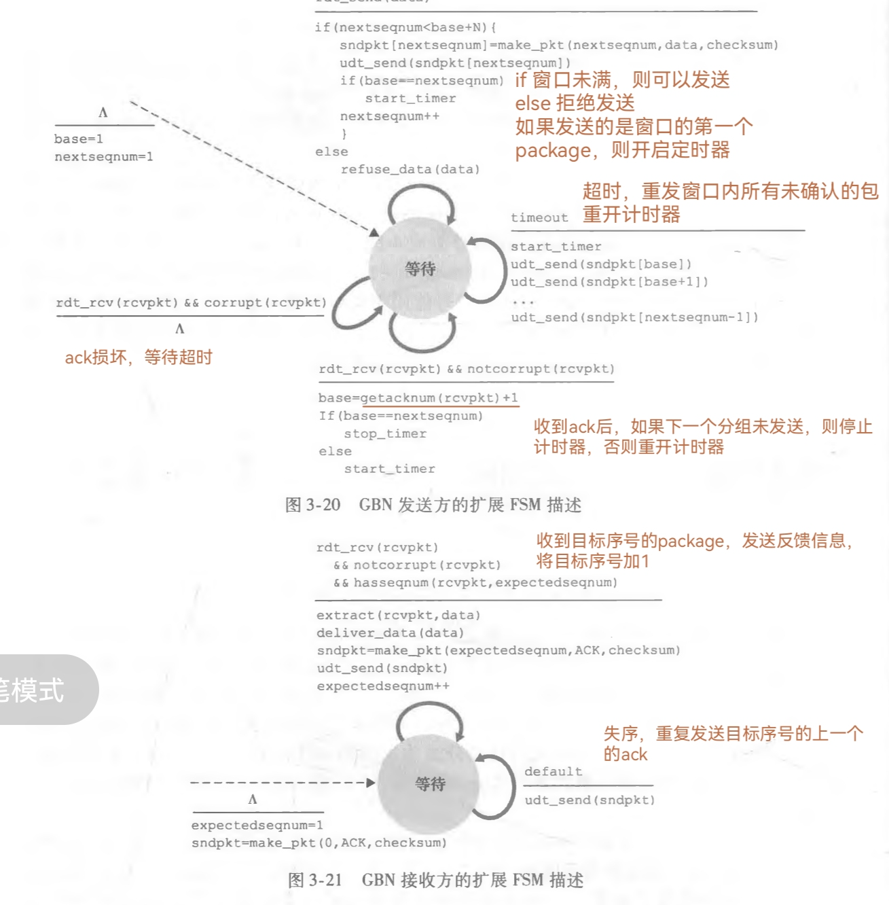

### 2.2 source code
```c
#include <stdio.h>
#include <string.h>

/*******************************************************************
 ALTERNATING BIT AND GO-BACK-N NETWORK EMULATOR: VERSION 1.1  J.F.Kurose

   This code should be used for PA2, unidirectional or bidirectional
   data transfer protocols (from A to B. Bidirectional transfer of data
   is for extra credit and is not required).  Network properties:
   - one way network delay averages five time units (longer if there
     are other messages in the channel for GBN), but can be larger
   - packets can be corrupted (either the header or the data portion)
     or lost, according to user-defined probabilities
   - packets will be delivered in the order in which they were sent
     (although some can be lost).
**********************************************************************/

#define BIDIRECTIONAL 0 /* change to 1 if you're doing extra credit */
                        /* and write a routine called B_output */
#define BUFFER_SIZE 50
const int N = 8;   // window size of sliding-window protocol
int last_rev_seq;  // last receiving packet seq in receriver B
int expected_seq;  // expected packet sequence in receriver B
int base;          // start seq of sending window in sender A
int nextseq;       // next packet to be sent in the sending sliding window

/* a "msg" is the data unit passed from layer 5 (teachers code) to layer  */
/* 4 (students' code).  It contains the data (characters) to be delivered */
/* to layer 5 via the students transport level protocol entities.         */
struct msg {
    char data[20];
};

/* a packet is the data unit passed from layer 4 (students code) to layer */
/* 3 (teachers code).  Note the pre-defined packet structure, which all   */
/* students must follow. */
struct pkt {
    int seqnum;
    int acknum;
    int checksum;
    char payload[20];
};

struct pkt buffer[BUFFER_SIZE];  // buffer in sending A in order to retransmit
/* called from layer 5, passed the data to be sent to other side */
A_output(message) struct msg message;
{
    if (nextseq >= base + N) {
        printf("Sending window is full now!\n");
        return -1;  // window is full
    }

    /* make pkt*/
    struct pkt sndPkt;
    sndPkt.seqnum = nextseq;
    sndPkt.acknum = -1;  // not a acknowledged packet
    memcpy(sndPkt.payload, message.data, sizeof(message.data));
    sndPkt.checksum = sndPkt.seqnum + sndPkt.acknum;
    for (int i = 0; i < 20; ++i) sndPkt.checksum += sndPkt.payload[i];
    printf("A is sending packet %d\n", nextseq);
    buffer[nextseq] = sndPkt;
    /*udt_send*/
    tolayer3(0, sndPkt);
    if (base == nextseq)  // first packet of sending window, start timer
        starttimer(0, 12.0);
    ++nextseq;
}

B_output(message) /* need be completed only for extra credit */
    struct msg message;
{}

/* called from layer 3, when a packet arrives for layer 4 */
A_input(packet) struct pkt packet;
{
    int tmp_checksum = packet.acknum + packet.seqnum;
    if (tmp_checksum != packet.checksum) {
        printf(
            "ACK %d packet  is  corrupt! will timeout and retransmit all "
            "packets in the sliding window!\n",
            packet.acknum);
        return -1;
    }
    if (packet.acknum < base) {
        printf("duplicated ACK %d", packet.acknum);
        return -1;
    }
    printf("ACK %d packet is not corrupt or duplicated! \n", packet.acknum);
    /*base = getacknum(rcvpkt) + 1 */
    base = packet.acknum + 1;
    if (base == nextseq)  // no packets sent in sliding window
    {
        printf("no packet sent in sliding window! stop timer! \n");
        stoptimer(0);
    } else  // exist unacknowledged packet in the window
    {
        printf(
            "The earliest sent packet is acknowledged, restart timer and move "
            "sliding window!\n");
        stoptimer(0);
        starttimer(0, 12.0);
    }
}

/* called when A's timer goes off */
A_timerinterrupt() {
    /*Go Back N  */
    printf("Elite-zx: sender A GO BACK N, from packet %d to packet %d \n", base,
           nextseq - 1);
    for (int i = base; i < nextseq; ++i) {
        tolayer3(0, buffer[i]);
    }
    starttimer(0, 12.0);
}

/* the following routine will be called once (only) before any other */
/* entity A routines are called. You can use it to do any initialization */
A_init() {
    base = 0;
    nextseq = 0;
}

/* Note that with simplex transfer from a-to-B, there is no B_output() */

/* called from layer 3, when a packet arrives for layer 4 at B*/
B_input(packet) struct pkt packet;
{
    struct pkt ack_packet;
    ack_packet.seqnum = packet.seqnum;
    int tmp_checksum = packet.acknum + packet.seqnum;
    for (int i = 0; i < 20; ++i) tmp_checksum += packet.payload[i];
    if (tmp_checksum == packet.checksum && packet.seqnum == expected_seq) {
        last_rev_seq = packet.seqnum;
        ++expected_seq;
        printf("notcorrupt and expected packet %d! sending right ACK %d!\n",
               packet.seqnum, last_rev_seq);
        /*extract*/
        struct msg extract_msg;
        memcpy(extract_msg.data, packet.payload, sizeof(packet.payload));
        /*deliver_data*/
        tolayer5(1, extract_msg);
        /* make_pkt*/
        ack_packet.acknum = last_rev_seq;
        ack_packet.checksum = ack_packet.seqnum + ack_packet.acknum;
        tolayer3(1, ack_packet);
    } else {
        printf(
            "corrupt or not expected packet %d (%d)! sending last receiving "
            "ACK "
            "%d!\n",
            expected_seq, packet.seqnum, last_rev_seq);
        ack_packet.acknum = last_rev_seq;
        ack_packet.checksum = ack_packet.seqnum + ack_packet.acknum;
        tolayer3(1, ack_packet);
    }
}

/* called when B's timer goes off */
B_timerinterrupt() {}

/* the following rouytine will be called once (only) before any other */
/* entity B routines are called. You can use it to do any initialization */
B_init() {
    last_rev_seq = -1;
    expected_seq = 0;
}
```
### 2.3. result
#### 2.1 no loss and corruption
下面将分析部分输出来验证代码的正确性

A先发出两个packet，B对这两个packet进行了确认，A收到确认，窗口右移2次，此时窗口内没有已发送的包，因此暂停计时器。
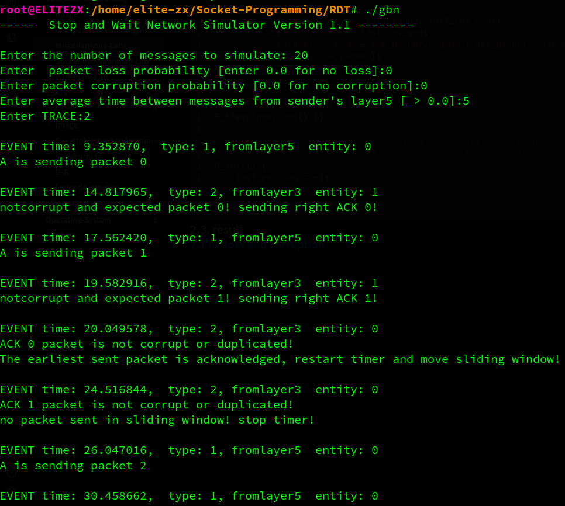
接着A发出packet2,3,4，B对这3个包逐一确认，但A在收到packet2的确认之前超时，A重传packet 2 to 4。B对packet2,3,4的ack到达A后，A移动窗口。B会收到冗余的packet 2,3,4，那么B会回复3个同样的ack 4信息，因为packet 4 是它最后收到的有序pkt。之后A会到收到冗余的ack4，A会打印说明自己收到了重复的ack信息。接着A继续发送packet5...
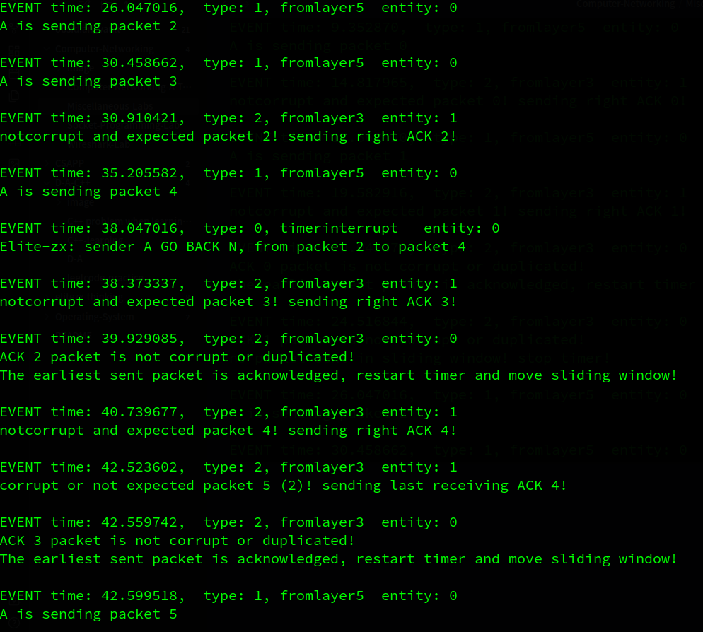
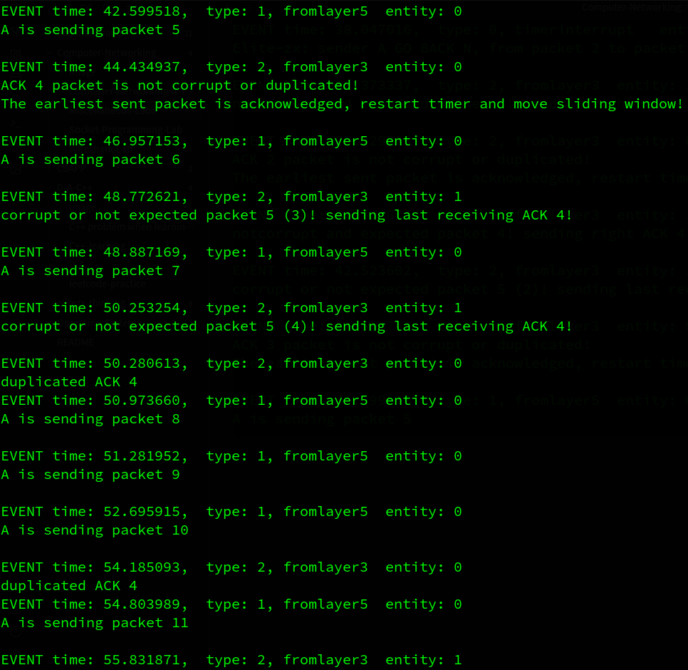
...
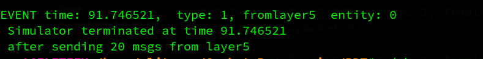
#### 2.2. loss and corruption
下面将分析部分输出来验证代码的正确性

这里就简单说一下了。B对pkt 0的确认信息损失了，而此时A已经发出了0～2的pkt（其中pkt 1 丢失，pkt 2 损失）, 因此A要超时重传pkt 0～2（pkt 2 损失）, 因为B已经正确收到了pkt 0, 因此在收到冗余的pkt 0 时反馈ack 0, A成功收到ack 0 并移动窗口， 而B收到了重传的pkt1 而发送ack1信息...
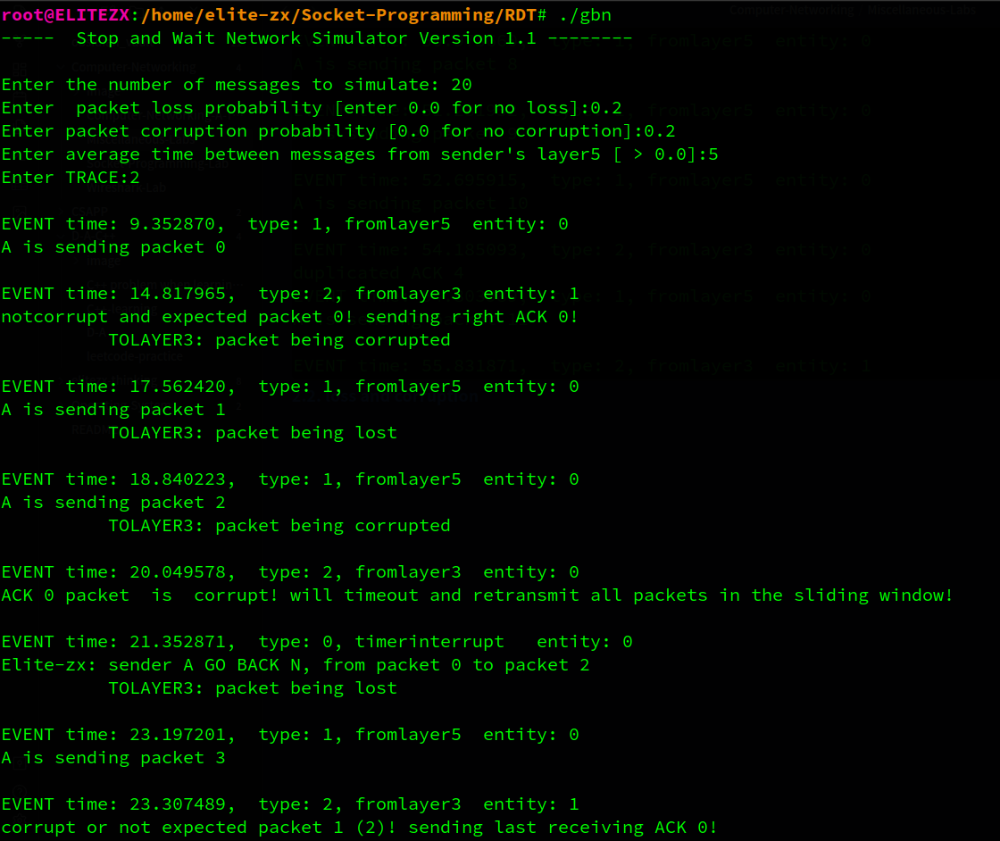
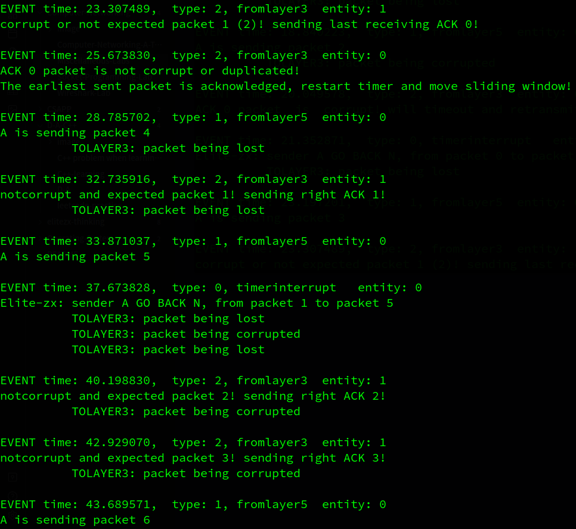
...
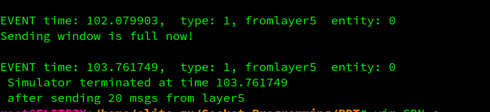

[reference](https://zhuanlan.zhihu.com/p/35390933)
